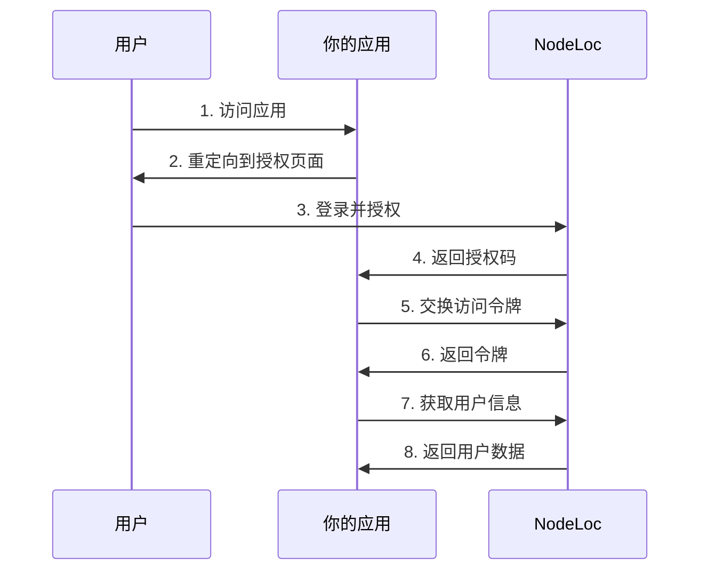

# NodeLoc OAuth2 快速开始

<Info>
NL OAuth2是一个基于Discourse的SSO的身份认证服务，允许应用程序使用NL用户系统进行身份验证和授权。
</Info>

## 服务端点

- **Web管理**: https://conn.nodeloc.cc/apps
- **OAuth2授权**: https://conn.nodeloc.cc/oauth2/auth  
- **Token端点**: https://conn.nodeloc.cc/oauth2/token
- **用户信息**: https://conn.nodeloc.cc/oauth2/userinfo

## 快速开始流程

<Steps>
  <Step title="注册应用">
    访问 [https://conn.nodeloc.cc/apps](https://conn.nodeloc.cc/apps) 创建新应用
  </Step>
  <Step title="获取凭据">
    获取 Client ID 和 Client Secret（请妥善保存）
  </Step>
  <Step title="实现授权流程">
    按照 OAuth2 标准流程实现用户授权
  </Step>
  <Step title="获取用户信息">
    使用访问令牌获取用户详细信息
  </Step>
</Steps>

## 应用注册

### 1. 访问管理界面

1. 访问 [https://conn.nodeloc.cc/apps](https://conn.nodeloc.cc/apps)
2. 首次访问会重定向到NL进行身份验证
3. 登录后点击"Create New Application"

### 2. 填写应用信息

```
应用名称: My App
描述: My OAuth2 Application  
重定向URI: https://myapp.com/auth/callback
允许的组: trust_level_0 (可选)
拒绝的组: banned (可选)
```

<Warning>
**重要**: 保存显示的Client Secret，它只会显示一次
</Warning>

### 3. 获取应用凭据

注册成功后，你将获得：
- **Client ID**: 用于标识应用
- **Client Secret**: 用于应用认证  
- **重定向URI**: 用户授权后的回调地址

## OAuth2 标准流程

### 流程概览

<CodeGroup>



</CodeGroup>

### 快速示例

<CodeGroup>

```javascript JavaScript
// 1. 重定向到授权页面
const authUrl = 'https://conn.nodeloc.cc/oauth2/auth?' + new URLSearchParams({
  response_type: 'code',
  client_id: 'YOUR_CLIENT_ID',
  redirect_uri: 'https://myapp.com/callback',
  scope: 'openid profile',
  state: 'random_state_string'
});

window.location.href = authUrl;

// 2. 处理回调，交换令牌
const response = await fetch('https://conn.nodeloc.cc/oauth2/token', {
  method: 'POST',
  headers: {
    'Authorization': 'Basic ' + btoa('CLIENT_ID:CLIENT_SECRET'),
    'Content-Type': 'application/x-www-form-urlencoded'
  },
  body: new URLSearchParams({
    grant_type: 'authorization_code',
    code: 'authorization_code_here',
    redirect_uri: 'https://myapp.com/callback'
  })
});

const tokens = await response.json();

// 3. 获取用户信息
const userResponse = await fetch('https://conn.nodeloc.cc/oauth2/userinfo', {
  headers: { 'Authorization': 'Bearer ' + tokens.access_token }
});

const userInfo = await userResponse.json();
```

```python Python
import requests
import base64

# 1. 生成授权URL
auth_url = 'https://conn.nodeloc.cc/oauth2/auth?' + urlencode({
    'response_type': 'code',
    'client_id': 'YOUR_CLIENT_ID',
    'redirect_uri': 'https://myapp.com/callback',
    'scope': 'openid profile',
    'state': 'random_state_string'
})

# 2. 交换访问令牌
auth_header = base64.b64encode(b'CLIENT_ID:CLIENT_SECRET').decode()

token_response = requests.post(
    'https://conn.nodeloc.cc/oauth2/token',
    data={
        'grant_type': 'authorization_code',
        'code': 'authorization_code_here',
        'redirect_uri': 'https://myapp.com/callback'
    },
    headers={
        'Authorization': f'Basic {auth_header}',
        'Content-Type': 'application/x-www-form-urlencoded'
    }
)

tokens = token_response.json()

# 3. 获取用户信息
user_response = requests.get(
    'https://conn.nodeloc.cc/oauth2/userinfo',
    headers={'Authorization': f'Bearer {tokens["access_token"]}'}
)

user_info = user_response.json()
```

```bash cURL
# 1. 生成授权URL (在浏览器中访问)
https://conn.nodeloc.cc/oauth2/auth?response_type=code&client_id=YOUR_CLIENT_ID&redirect_uri=https://myapp.com/callback&scope=openid

# 2. 交换访问令牌
curl -X POST https://conn.nodeloc.cc/oauth2/token \
  -H "Authorization: Basic $(echo -n 'CLIENT_ID:CLIENT_SECRET' | base64)" \
  -H "Content-Type: application/x-www-form-urlencoded" \
  -d "grant_type=authorization_code&code=AUTH_CODE&redirect_uri=https://myapp.com/callback"

# 3. 获取用户信息
curl -H "Authorization: Bearer ACCESS_TOKEN" \
  https://conn.nodeloc.cc/oauth2/userinfo
```

</CodeGroup>

## 安全最佳实践

### 客户端密钥保护

<Danger>
**永远不要**在前端代码中暴露Client Secret
</Danger>

- 使用环境变量存储敏感信息
- 在服务器端处理令牌交换
- 定期轮换客户端密钥

### CSRF 防护

<Tip>
始终使用随机的`state`参数防止CSRF攻击
</Tip>

- 生成随机state值
- 在回调中验证state参数
- 使用HTTPS传输敏感数据

### 令牌管理

- 安全存储访问令牌和刷新令牌
- 实现令牌自动刷新机制
- 处理令牌过期情况

## 下一步

<CardGroup cols={2}>
  <Card title="API 参考" icon="code" href="/api-reference">
    查看完整的 API 端点文档
  </Card>
  <Card title="代码示例" icon="brackets-curly" href="/examples">
    查看更多集成示例
  </Card>
  <Card title="错误处理" icon="triangle-exclamation" href="/errors">
    了解错误代码和处理方式
  </Card>
  <Card title="最佳实践" icon="shield-check" href="/best-practices">
    学习安全最佳实践
  </Card>
</CardGroup>