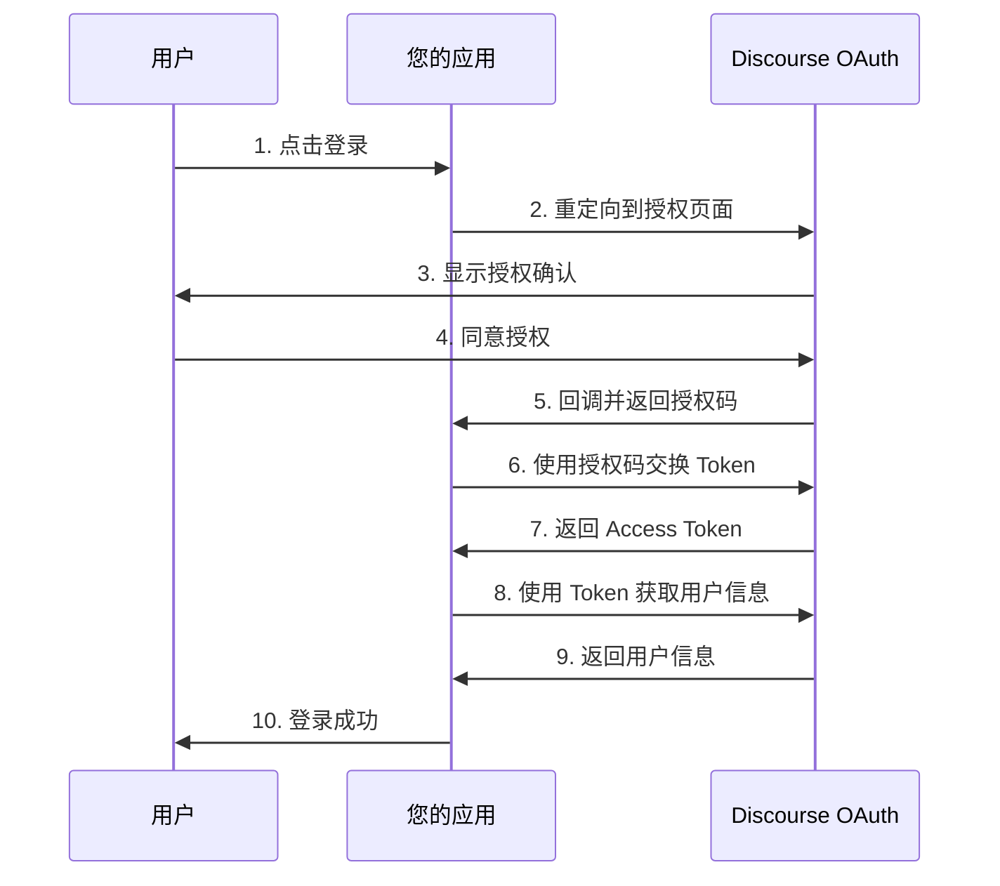

# NodeLoc OAuth Provider 对接文档

本文档提供完整的第三方应用对接指南，帮助您将 NodeLoc OAuth Provider 集成到您的应用中。

## 📋 目录

- [快速开始](#快速开始)
- [OAuth 2.0 授权流程](#oauth-20-授权流程)
- [API 端点](#api-端点)
- [集成示例](#集成示例)
- [常见问题](#常见问题)

## 🚀 快速开始

### 1. 创建 OAuth 应用

访问 NodeLoc 论坛并创建 OAuth 应用：

```
https://www.nodeloc.com/oauth-provider/applications
```

记录以下信息：

- **Client ID**: 应用的唯一标识符
- **Client Secret**: 应用密钥（请妥善保管）
- **Redirect URI**: 授权后的回调地址

### 2. 配置环境变量

```bash
NODELOC_URL=https://www.nodeloc.com
NODELOC_CLIENT_ID=your-client-id
NODELOC_CLIENT_SECRET=your-client-secret
NODELOC_REDIRECT_URI=http://yoururl.com/auth/callback
```

### 3. 开始集成

选择您的开发语言，参考下方的集成示例快速开始。

---

## 🔐 OAuth 2.0 授权流程

### 流程图



### 详细步骤

#### 步骤 1: 重定向到授权页面

将用户重定向到以下 URL：

```
https://www.nodeloc.com/oauth-provider/authorize?
  client_id=YOUR_CLIENT_ID&
  redirect_uri=YOUR_REDIRECT_URI&
  response_type=code&
  scope=openid%20profile&
  state=RANDOM_STATE_STRING
```

**参数说明：**

| 参数              | 必填 | 说明                               |
| --------------- | --- | -------------------------------- |
| `client_id`     | ✓  | 您的应用 Client ID                   |
| `redirect_uri`  | ✓  | 授权后的回调地址（必须与应用配置一致）              |
| `response_type` | ✓  | 固定值：`code`                       |
| `scope`         | -  | 请求的权限范围，如 `openid profile email` |
| `state`         | 推荐 | 随机字符串，用于防止 CSRF 攻击               |

#### 步骤 2: 接收授权码

用户授权后，NodelLoc 会重定向回您的 `redirect_uri`，并附带授权码：

```
https://your-app.com/callback?
  code=AUTHORIZATION_CODE&
  state=YOUR_STATE_STRING
```

**安全提示：** 请验证 `state` 参数是否与步骤 1 发送的一致。

#### 步骤 3: 交换 Access Token

使用授权码交换 Access Token：

```bash
curl -X POST https://www.nodeloc.com/oauth-provider/token \
  -H "Content-Type: application/x-www-form-urlencoded" \
  -d "grant_type=authorization_code" \
  -d "code=AUTHORIZATION_CODE" \
  -d "redirect_uri=YOUR_REDIRECT_URI" \
  -d "client_id=YOUR_CLIENT_ID" \
  -d "client_secret=YOUR_CLIENT_SECRET"
```

**响应示例：**

```json
{
  "access_token": "eyJhbGciOiJIUzI1NiIsInR5cCI6IkpXVCJ9...",
  "token_type": "Bearer",
  "expires_in": 7200,
  "refresh_token": "optional_refresh_token",
  "scope": "openid profile email"
}
```

#### 步骤 4: 获取用户信息

使用 Access Token 获取用户信息：

```bash
curl -X GET https://www.nodeloc.com/oauth-provider/userinfo \
  -H "Authorization: Bearer ACCESS_TOKEN"
```

**响应示例：**

```json
{
  "id": 123,
  "username": "user1",
  "name": "user1",
  "avatar_url": "https://discourse.com/avatar.png",
  "trust_level": 2
}
```

**字段说明：**

| 字段            | 类型      | 说明                      |
| ------------- | ------- | ----------------------- |
| `id`          | integer | 用户的唯一标识符                |
| `username`    | string  | 用户名                     |
| `name`        | string  | 显示名称（如果为空，则使用 username） |
| `avatar_url`  | string  | 用户头像 URL                |
| `trust_level` | integer | 用户信任等级（0-4）             |

---

## 🔌 API 端点

### 授权端点

```
GET /oauth-provider/authorize
```

用于发起授权请求，用户需要在浏览器中访问此端点。

### Token 端点

```
POST /oauth-provider/token
```

用于交换授权码获取 Access Token，或使用 Refresh Token 刷新访问令牌。

**支持的 Grant Types：**

- `authorization_code` - 授权码模式
- `refresh_token` - 刷新令牌（如果支持）

### UserInfo 端点

```
GET /oauth-provider/userinfo
```

使用 Access Token 获取当前授权用户的信息。

**请求头：**

```
Authorization: Bearer YOUR_ACCESS_TOKEN
```

### OIDC Discovery 端点（可选）

```
GET /.well-known/openid-configuration
```

返回 OIDC 配置信息，支持自动发现。

---

---

## ❓ 常见问题

### 1. 如何处理 Token 过期？

Access Token 默认有效期为 2 小时（7200 秒）。过期后需要重新授权，或使用 Refresh Token（如果支持）。

```javascript
// 检查 Token 是否过期
function isTokenExpired(expiresAt) {
  return Date.now() >= expiresAt * 1000;
}

// 使用 Refresh Token 刷新
async function refreshAccessToken(refreshToken) {
  const response = await fetch(`${DISCOURSE_URL}/oauth-provider/token`, {
    method: 'POST',
    headers: {
      'Content-Type': 'application/x-www-form-urlencoded'
    },
    body: new URLSearchParams({
      grant_type: 'refresh_token',
      refresh_token: refreshToken,
      client_id: CLIENT_ID,
      client_secret: CLIENT_SECRET
    })
  });
  
  return await response.json();
}
```

### 2. 如何处理错误？

所有错误都会返回标准的 OAuth 2.0 错误格式：

```json
{
  "error": "invalid_client",
  "error_description": "Invalid client credentials"
}
```

**常见错误代码：**

| 错误代码                     | 说明                    | 解决方法                    |
| ------------------------ | --------------------- | ----------------------- |
| `invalid_request`        | 请求参数缺失或无效             | 检查必填参数                  |
| `invalid_client`         | Client ID 或 Secret 无效 | 验证应用凭证                  |
| `invalid_grant`          | 授权码无效或已过期             | 重新发起授权                  |
| `unauthorized_client`    | 客户端未授权                | 检查应用状态                  |
| `unsupported_grant_type` | 不支持的 Grant Type       | 使用 `authorization_code` |
| `invalid_token`          | Access Token 无效       | 重新获取 Token              |

### 3. name 字段为空怎么办？

当用户没有设置显示名称时，`name` 字段会自动使用 `username` 的值。您不需要做额外处理。

```javascript
// UserInfo 响应示例（name 为空时）
{
  "id": 123,
  "username": "user1",
  "name": "user1",  // 自动使用 username
  "avatar_url": "...",
  "trust_level": 1
}
```

### 4. 如何测试 OAuth 集成？

使用以下测试脚本快速验证：

```bash
# 1. 在浏览器中访问授权 URL
https://www.nodeloc.com/oauth-provider/authorize?client_id=YOUR_ID&redirect_uri=http://localhost:3000/callback&response_type=code&state=test

# 2. 授权后获取 code，然后交换 Token
curl -X POST https://www.nodeloc.com/oauth-provider/token \
  -d "grant_type=authorization_code" \
  -d "code=YOUR_CODE" \
  -d "redirect_uri=http://localhost:3000/callback" \
  -d "client_id=YOUR_ID" \
  -d "client_secret=YOUR_SECRET"

# 3. 使用 Token 获取用户信息
curl -X GET https://www.nodeloc.com/oauth-provider/userinfo \
  -H "Authorization: Bearer YOUR_ACCESS_TOKEN"
```

### 5. 支持哪些 Scope？

目前支持以下 scope：

- `openid` - OpenID Connect 基础支持
- `profile` - 用户基本信息（username, name）

示例：

```
scope=openid profile
```

### 6. 如何保护 Client Secret？

**重要安全提示：**

- ✅ **服务端存储**: 将 Client Secret 存储在服务器端环境变量中
- ✅ **HTTPS 通信**: 生产环境必须使用 HTTPS
- ✅ **定期更换**: 定期在 NodeLoc中重新生成 Client Secret
- ❌ **不要暴露**: 永远不要将 Secret 提交到版本控制或前端代码中
- ❌ **不要记录**: 不要在日志中记录完整的 Secret

### 7. 生产环境部署清单

部署前请确认以下事项：

- 使用 HTTPS 协议
- 配置正确的 Redirect URI
- 环境变量安全存储
- 实现错误处理和日志记录
- 添加 State 参数防止 CSRF
- 实现 Token 刷新机制
- 配置会话超时
- 添加用户退出登录功能
- 测试完整的授权流程