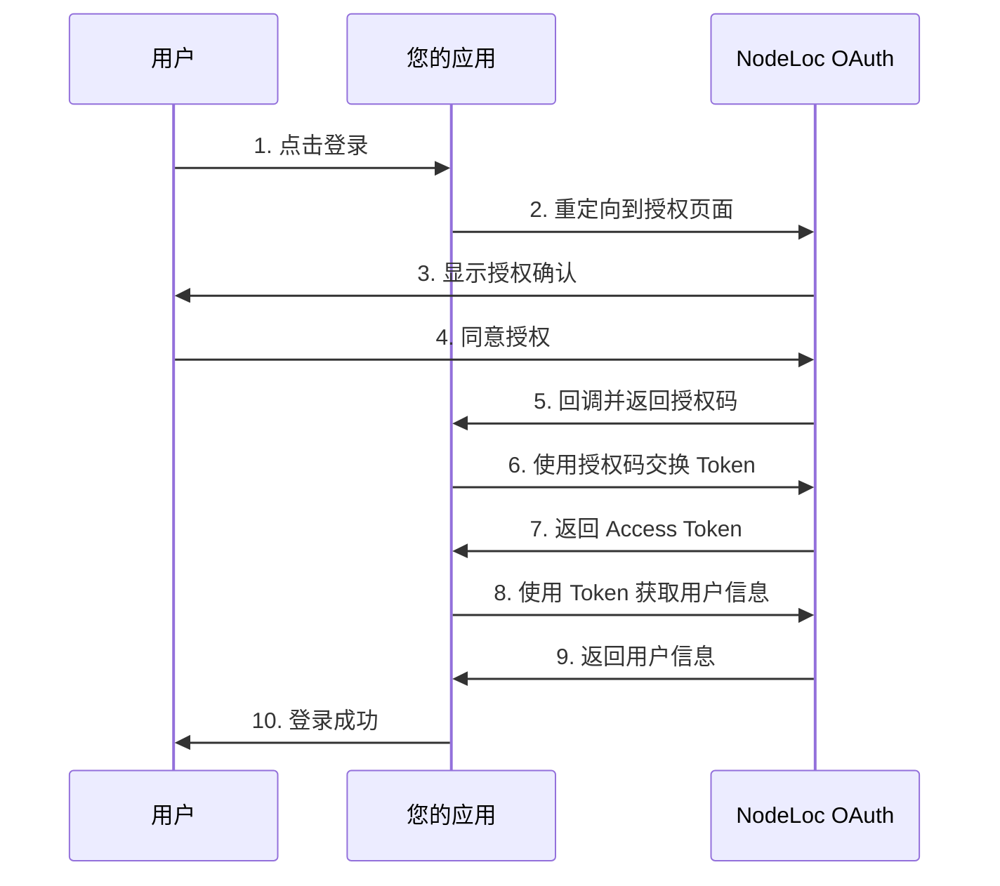

# NodeLoc OAuth Provider 对接文档

本文档提供完整的第三方应用对接指南，帮助您将 NodeLoc OAuth Provider 集成到您的应用中。

## 📋 目录

- [快速开始](#快速开始)
- [OAuth 2.0 授权流程](#oauth-20-授权流程)
- [API 端点](#api-端点)
- [集成示例](#集成示例)
- [常见问题](#常见问题)

## 🚀 快速开始

### 1. 创建 OAuth 应用

访问 NodeLoc 论坛并创建 OAuth 应用：

```
https://www.nodeloc.com.com/oauth-provider/applications
```

记录以下信息：
- **Client ID**: 应用的唯一标识符
- **Client Secret**: 应用密钥（请妥善保管）
- **Redirect URI**: 授权后的回调地址

### 2. 配置环境变量

```bash
NodeLoc_URL=https://www.nodeloc.com.com
NodeLoc_CLIENT_ID=your-client-id
NodeLoc_CLIENT_SECRET=your-client-secret
NodeLoc_REDIRECT_URI=http://your-url.com/auth/callback
```

### 3. 开始集成

选择您的开发语言，参考下方的集成示例快速开始。

---

## 🔐 OAuth 2.0 授权流程

### 流程图



### 详细步骤

#### 步骤 1: 重定向到授权页面

将用户重定向到以下 URL：

```
https://www.nodeloc.com.com/oauth-provider/authorize?
  client_id=YOUR_CLIENT_ID&
  redirect_uri=YOUR_REDIRECT_URI&
  response_type=code&
  scope=openid%20profile%20email&
  state=RANDOM_STATE_STRING
```

**参数说明：**

| 参数 | 必填 | 说明 |
|------|------|------|
| `client_id` | ✓ | 您的应用 Client ID |
| `redirect_uri` | ✓ | 授权后的回调地址（必须与应用配置一致） |
| `response_type` | ✓ | 固定值：`code` |
| `scope` | - | 请求的权限范围，如 `openid profile email`（详见下方说明） |
| `state` | 推荐 | 随机字符串，用于防止 CSRF 攻击 |

**可用的 Scope（权限范围）：**

| Scope | 说明 | 是否必需 | 需要审核 |
|-------|------|----------|----------|
| `openid` | 标准 OpenID Connect scope | **是（必需）** | 否 |
| `profile` | 用户资料（头像、简介等） | 否 | 否 |
| `email` | 用户邮箱地址 | 否 | **是** |

**注意事项：**
- 如果应用申请了 `email` 权限，需要管理员审核后才能使用
- 审核状态可以在应用管理页面查看
- 未通过审核的应用将无法完成授权流程

#### 步骤 2: 接收授权码

用户授权后，NodeLoc 会重定向回您的 `redirect_uri`，并附带授权码：

**授权成功：**
```
https://your-app.com/callback?
  code=AUTHORIZATION_CODE&
  state=YOUR_STATE_STRING
```

**用户拒绝授权：**
```
https://your-app.com/callback?
  error=access_denied&
  error_description=The+resource+owner+or+authorization+server+denied+the+request&
  state=YOUR_STATE_STRING
```

**错误参数说明：**

| 参数 | 说明 |
|------|------|
| `error` | 错误代码，`access_denied` 表示用户拒绝授权 |
| `error_description` | 错误描述信息 |
| `state` | 您在步骤 1 中发送的 state 参数 |

**处理建议：**
- 检查是否存在 `error` 参数来判断授权是否成功
- 如果用户拒绝授权，应该友好地提示用户，并提供重新授权的选项
- 记录拒绝授权的事件，以便分析用户行为

**示例代码（Node.js）：**
```javascript
app.get('/callback', (req, res) => {
  const { code, error, error_description, state } = req.query;
  
  // 验证 state 参数
  if (state !== req.session.oauthState) {
    return res.status(400).send('Invalid state parameter');
  }
  
  // 检查是否有错误
  if (error) {
    if (error === 'access_denied') {
      // 用户拒绝授权
      return res.send(`
        <h1>授权被拒绝</h1>
        <p>您拒绝了授权请求。如需使用此服务，请<a href="/auth/NodeLoc">重新授权</a>。</p>
      `);
    }
    // 其他错误
    return res.status(400).send(`授权错误: ${error_description || error}`);
  }
  
  // 继续处理授权码...
});
```

**安全提示：** 请验证 `state` 参数是否与步骤 1 发送的一致。

#### 步骤 3: 交换 Access Token

使用授权码交换 Access Token：

```bash
curl -X POST https://www.nodeloc.com.com/oauth-provider/token \
  -H "Content-Type: application/x-www-form-urlencoded" \
  -d "grant_type=authorization_code" \
  -d "code=AUTHORIZATION_CODE" \
  -d "redirect_uri=YOUR_REDIRECT_URI" \
  -d "client_id=YOUR_CLIENT_ID" \
  -d "client_secret=YOUR_CLIENT_SECRET"
```

**响应示例：**

```json
{
  "access_token": "eyJhbGciOiJIUzI1NiIsInR5cCI6IkpXVCJ9...",
  "token_type": "Bearer",
  "expires_in": 7200,
  "refresh_token": "optional_refresh_token",
  "scope": "openid profile email"
}
```

#### 步骤 4: 获取用户信息

使用 Access Token 获取用户信息：

```bash
curl -X GET https://www.nodeloc.com.com/oauth-provider/userinfo \
  -H "Authorization: Bearer ACCESS_TOKEN"
```

**响应示例：**

```json
{
  "id": 123,
  "username": "user1",
  "name": "user1",
  "avatar_url": "https://NodeLoc.com/avatar.png",
  "trust_level": 2,
  "email": "user1@example.com"
}
```

**字段说明：**

| 字段 | 类型 | 说明 |
|------|------|------|
| `id` | integer | 用户的唯一标识符 |
| `username` | string | 用户名 |
| `name` | string | 显示名称（如果为空，则使用 username） |
| `avatar_url` | string | 用户头像 URL |
| `trust_level` | integer | 用户信任等级（0-4） |
| `email` | string | 用户邮箱（仅当 scope 包含 `email` 时返回） |

---

## 🔌 API 端点

### 授权端点

```
GET /oauth-provider/authorize
```

用于发起授权请求，用户需要在浏览器中访问此端点。

### Token 端点

```
POST /oauth-provider/token
```

用于交换授权码获取 Access Token，或使用 Refresh Token 刷新访问令牌。

**支持的 Grant Types：**
- `authorization_code` - 授权码模式
- `refresh_token` - 刷新令牌（如果支持）

### UserInfo 端点

```
GET /oauth-provider/userinfo
```

使用 Access Token 获取当前授权用户的信息。

**请求头：**
```
Authorization: Bearer YOUR_ACCESS_TOKEN
```

### OIDC Discovery 端点（可选）

```
GET /.well-known/openid-configuration
```

返回 OIDC 配置信息，支持自动发现。

---

## 💻 集成示例

### Node.js + Express

#### 安装依赖

```bash
npm install express express-session passport passport-oauth2
```

#### 完整示例代码

```javascript
const express = require('express');
const session = require('express-session');
const passport = require('passport');
const OAuth2Strategy = require('passport-oauth2');

const app = express();

// 配置 Session
app.use(session({
  secret: 'your-secret-key',
  resave: false,
  saveUninitialized: false,
  cookie: { secure: false } // 生产环境请设置为 true
}));

app.use(passport.initialize());
app.use(passport.session());

// 配置 NodeLoc OAuth2 策略
passport.use('NodeLoc', new OAuth2Strategy({
    authorizationURL: `${process.env.NodeLoc_URL}/oauth-provider/authorize`,
    tokenURL: `${process.env.NodeLoc_URL}/oauth-provider/token`,
    clientID: process.env.NodeLoc_CLIENT_ID,
    clientSecret: process.env.NodeLoc_CLIENT_SECRET,
    callbackURL: process.env.NodeLoc_REDIRECT_URI,
    scope: ['openid', 'profile', 'email']
  },
  async (accessToken, refreshToken, profile, done) => {
    try {
      // 获取用户信息
      const response = await fetch(
        `${process.env.NodeLoc_URL}/oauth-provider/userinfo`,
        {
          headers: {
            'Authorization': `Bearer ${accessToken}`
          }
        }
      );
      
      const user = await response.json();
      
      // 将 access_token 保存到用户对象
      user.accessToken = accessToken;
      user.refreshToken = refreshToken;
      
      return done(null, user);
    } catch (error) {
      return done(error);
    }
  }
));

// 序列化和反序列化用户
passport.serializeUser((user, done) => {
  done(null, user);
});

passport.deserializeUser((user, done) => {
  done(null, user);
});

// 路由

// 首页 - 显示登录状态
app.get('/', (req, res) => {
  if (req.isAuthenticated()) {
    res.send(`
      <!DOCTYPE html>
      <html>
        <head>
          <meta charset="utf-8">
          <title>欢迎</title>
          <style>
            body {
              font-family: Arial, sans-serif;
              max-width: 600px;
              margin: 50px auto;
              padding: 20px;
            }
            .user-card {
              border: 1px solid #ddd;
              border-radius: 8px;
              padding: 20px;
              background: #f9f9f9;
            }
            .avatar {
              width: 80px;
              height: 80px;
              border-radius: 50%;
            }
            .logout-btn {
              background: #dc3545;
              color: white;
              padding: 10px 20px;
              text-decoration: none;
              border-radius: 4px;
              display: inline-block;
              margin-top: 15px;
            }
          </style>
        </head>
        <body>
          <div class="user-card">
            <h1>欢迎，${req.user.name}！</h1>
            
            <p><strong>用户名：</strong> ${req.user.username}</p>
            <p><strong>用户 ID：</strong> ${req.user.id}</p>
            <p><strong>信任等级：</strong> ${req.user.trust_level}</p>
            <a href="/logout" class="logout-btn">退出登录</a>
          </div>
        </body>
      </html>
    `);
  } else {
    res.send(`
      <!DOCTYPE html>
      <html>
        <head>
          <meta charset="utf-8">
          <title>登录</title>
          <style>
            body {
              font-family: Arial, sans-serif;
              display: flex;
              justify-content: center;
              align-items: center;
              height: 100vh;
              margin: 0;
            }
            .login-btn {
              background: #0088cc;
              color: white;
              padding: 15px 30px;
              text-decoration: none;
              border-radius: 4px;
              font-size: 18px;
            }
            .login-btn:hover {
              background: #006699;
            }
          </style>
        </head>
        <body>
          <a href="/auth/NodeLoc" class="login-btn">使用 NodeLoc 登录</a>
        </body>
      </html>
    `);
  }
});

// 发起授权
app.get('/auth/NodeLoc', passport.authenticate('NodeLoc'));

// 授权回调
app.get('/auth/callback',
  passport.authenticate('NodeLoc', { failureRedirect: '/login' }),
  (req, res) => {
    // 登录成功，重定向到首页
    res.redirect('/');
  }
);

// 退出登录
app.get('/logout', (req, res) => {
  req.logout((err) => {
    if (err) {
      return res.redirect('/');
    }
    res.redirect('/');
  });
});

// API 示例 - 获取当前用户
app.get('/api/me', (req, res) => {
  if (!req.isAuthenticated()) {
    return res.status(401).json({ error: 'Not authenticated' });
  }
  
  res.json({
    id: req.user.id,
    username: req.user.username,
    name: req.user.name,
    avatar_url: req.user.avatar_url,
    trust_level: req.user.trust_level
  });
});

// 启动服务器
const PORT = process.env.PORT || 3000;
app.listen(PORT, () => {
  console.log(`服务器运行在 http://localhost:${PORT}`);
  console.log(`请确保设置了以下环境变量：`);
  console.log(`  - NodeLoc_URL`);
  console.log(`  - NodeLoc_CLIENT_ID`);
  console.log(`  - NodeLoc_CLIENT_SECRET`);
  console.log(`  - NodeLoc_REDIRECT_URI`);
});
```

#### 环境变量配置

创建 `.env` 文件：

```bash
NodeLoc_URL=https://www.nodeloc.com.com
NodeLoc_CLIENT_ID=your-client-id
NodeLoc_CLIENT_SECRET=your-client-secret
NodeLoc_REDIRECT_URI=http://your-url.com/auth/callback
PORT=3000
```

#### 运行应用

```bash
node app.js
```

访问 `http://your-url.com` 即可看到登录页面。

---

### Python + Flask

#### 安装依赖

```bash
pip install flask authlib requests
```

#### 完整示例代码

```python
from flask import Flask, redirect, url_for, session, jsonify
from authlib.integrations.flask_client import OAuth
import os

app = Flask(__name__)
app.secret_key = os.urandom(24)

# 配置 OAuth
oauth = OAuth(app)

NodeLoc = oauth.register(
    name='NodeLoc',
    client_id=os.getenv('NodeLoc_CLIENT_ID'),
    client_secret=os.getenv('NodeLoc_CLIENT_SECRET'),
    authorize_url=f"{os.getenv('NodeLoc_URL')}/oauth-provider/authorize",
    access_token_url=f"{os.getenv('NodeLoc_URL')}/oauth-provider/token",
    userinfo_endpoint=f"{os.getenv('NodeLoc_URL')}/oauth-provider/userinfo",
    client_kwargs={
        'scope': 'openid profile email'
    }
)

@app.route('/')
def index():
    """首页 - 显示登录状态"""
    user = session.get('user')
    
    if user:
        return f'''
            <!DOCTYPE html>
            <html>
                <head>
                    <meta charset="utf-8">
                    <title>欢迎</title>
                    <style>
                        body {{
                            font-family: Arial, sans-serif;
                            max-width: 600px;
                            margin: 50px auto;
                            padding: 20px;
                        }}
                        .user-card {{
                            border: 1px solid #ddd;
                            border-radius: 8px;
                            padding: 20px;
                            background: #f9f9f9;
                        }}
                        .avatar {{
                            width: 80px;
                            height: 80px;
                            border-radius: 50%;
                        }}
                        .logout-btn {{
                            background: #dc3545;
                            color: white;
                            padding: 10px 20px;
                            text-decoration: none;
                            border-radius: 4px;
                            display: inline-block;
                            margin-top: 15px;
                        }}
                    </style>
                </head>
                <body>
                    <div class="user-card">
                        <h1>欢迎，{user['name']}！</h1>
                        
                        <p><strong>用户名：</strong> {user['username']}</p>
                        <p><strong>用户 ID：</strong> {user['id']}</p>
                        <p><strong>信任等级：</strong> {user['trust_level']}</p>
                        <a href="/logout" class="logout-btn">退出登录</a>
                    </div>
                </body>
            </html>
        '''
    
    return '''
        <!DOCTYPE html>
        <html>
            <head>
                <meta charset="utf-8">
                <title>登录</title>
                <style>
                    body {
                        font-family: Arial, sans-serif;
                        display: flex;
                        justify-content: center;
                        align-items: center;
                        height: 100vh;
                        margin: 0;
                    }
                    .login-btn {
                        background: #0088cc;
                        color: white;
                        padding: 15px 30px;
                        text-decoration: none;
                        border-radius: 4px;
                        font-size: 18px;
                    }
                    .login-btn:hover {
                        background: #006699;
                    }
                </style>
            </head>
            <body>
                <a href="/login" class="login-btn">使用 NodeLoc 登录</a>
            </body>
        </html>
    '''

@app.route('/login')
def login():
    """发起授权"""
    redirect_uri = url_for('authorize', _external=True)
    return NodeLoc.authorize_redirect(redirect_uri)

@app.route('/authorize')
def authorize():
    """授权回调"""
    token = NodeLoc.authorize_access_token()
    
    # 获取用户信息
    resp = NodeLoc.get('/oauth-provider/userinfo', token=token)
    user = resp.json()
    
    # 保存到 session
    session['user'] = user
    session['token'] = token
    
    return redirect('/')

@app.route('/logout')
def logout():
    """退出登录"""
    session.pop('user', None)
    session.pop('token', None)
    return redirect('/')

@app.route('/api/me')
def api_me():
    """API 示例 - 获取当前用户"""
    user = session.get('user')
    
    if not user:
        return jsonify({'error': 'Not authenticated'}), 401
    
    return jsonify({
        'id': user['id'],
        'username': user['username'],
        'name': user['name'],
        'avatar_url': user['avatar_url'],
        'trust_level': user['trust_level']
    })

if __name__ == '__main__':
    # 检查环境变量
    required_vars = ['NodeLoc_URL', 'NodeLoc_CLIENT_ID', 'NodeLoc_CLIENT_SECRET']
    missing_vars = [var for var in required_vars if not os.getenv(var)]
    
    if missing_vars:
        print(f"错误：缺少环境变量: {', '.join(missing_vars)}")
        exit(1)
    
    print("服务器运行在 http://localhost:5000")
    app.run(debug=True)
```

#### 运行应用

```bash
export NodeLoc_URL=https://www.nodeloc.com.com
export NodeLoc_CLIENT_ID=your-client-id
export NodeLoc_CLIENT_SECRET=your-client-secret

python app.py
```

---

### Ruby on Rails + Devise

#### Gemfile

```ruby
gem 'devise'
gem 'omniauth'
gem 'omniauth-oauth2'
gem 'omniauth-rails_csrf_protection'
```

#### config/initializers/devise.rb

```ruby
Devise.setup do |config|
  config.omniauth :NodeLoc,
    ENV['NodeLoc_CLIENT_ID'],
    ENV['NodeLoc_CLIENT_SECRET'],
    {
      client_options: {
        site: ENV['NodeLoc_URL'],
        authorize_url: '/oauth-provider/authorize',
        token_url: '/oauth-provider/token'
      },
      scope: 'openid profile email'
    }
end
```

#### app/models/user.rb

```ruby
class User < ApplicationRecord
  devise :omniauthable, omniauth_providers: [:NodeLoc]
  
  def self.from_omniauth(auth)
    where(provider: auth.provider, uid: auth.uid).first_or_create do |user|
      user.email = auth.info.email || "#{auth.uid}@NodeLoc.local"
      user.username = auth.info.username
      user.name = auth.info.name
      user.avatar_url = auth.info.image
      user.password = Devise.friendly_token[0, 20]
    end
  end
end
```

#### app/controllers/users/omniauth_callbacks_controller.rb

```ruby
class Users::OmniauthCallbacksController < Devise::OmniauthCallbacksController
  def NodeLoc
    @user = User.from_omniauth(request.env['omniauth.auth'])

    if @user.persisted?
      sign_in_and_redirect @user, event: :authentication
      set_flash_message(:notice, :success, kind: 'NodeLoc') if is_navigational_format?
    else
      session['devise.NodeLoc_data'] = request.env['omniauth.auth'].except(:extra)
      redirect_to new_user_registration_url
    end
  end

  def failure
    redirect_to root_path
  end
end
```

---

## ❓ 常见问题

### 1. 如何处理 Token 过期？

Access Token 默认有效期为 2 小时（7200 秒）。过期后需要重新授权，或使用 Refresh Token（如果支持）。

```javascript
// 检查 Token 是否过期
function isTokenExpired(expiresAt) {
  return Date.now() >= expiresAt * 1000;
}

// 使用 Refresh Token 刷新
async function refreshAccessToken(refreshToken) {
  const response = await fetch(`${NodeLoc_URL}/oauth-provider/token`, {
    method: 'POST',
    headers: {
      'Content-Type': 'application/x-www-form-urlencoded'
    },
    body: new URLSearchParams({
      grant_type: 'refresh_token',
      refresh_token: refreshToken,
      client_id: CLIENT_ID,
      client_secret: CLIENT_SECRET
    })
  });
  
  return await response.json();
}
```

### 2. 如何处理错误？

所有错误都会返回标准的 OAuth 2.0 错误格式：

```json
{
  "error": "invalid_client",
  "error_description": "Invalid client credentials"
}
```

**常见错误代码：**

| 错误代码 | 说明 | 解决方法 |
|---------|------|---------|
| `invalid_request` | 请求参数缺失或无效 | 检查必填参数 |
| `invalid_client` | Client ID 或 Secret 无效 | 验证应用凭证 |
| `invalid_grant` | 授权码无效或已过期 | 重新发起授权 |
| `unauthorized_client` | 客户端未授权 | 检查应用状态 |
| `unsupported_grant_type` | 不支持的 Grant Type | 使用 `authorization_code` |
| `invalid_token` | Access Token 无效 | 重新获取 Token |

### 3. name 字段为空怎么办？

当用户没有设置显示名称时，`name` 字段会自动使用 `username` 的值。您不需要做额外处理。

```javascript
// UserInfo 响应示例（name 为空时）
{
  "id": 123,
  "username": "user1",
  "name": "user1",  // 自动使用 username
  "avatar_url": "...",
  "trust_level": 1
}
```

### 4. 如何测试 OAuth 集成？

使用以下测试脚本快速验证：

```bash
# 1. 在浏览器中访问授权 URL
https://www.nodeloc.com.com/oauth-provider/authorize?client_id=YOUR_ID&redirect_uri=http://your-url.com/callback&response_type=code&state=test

# 2. 授权后获取 code，然后交换 Token
curl -X POST https://www.nodeloc.com.com/oauth-provider/token \
  -d "grant_type=authorization_code" \
  -d "code=YOUR_CODE" \
  -d "redirect_uri=http://your-url.com/callback" \
  -d "client_id=YOUR_ID" \
  -d "client_secret=YOUR_SECRET"

# 3. 使用 Token 获取用户信息
curl -X GET https://www.nodeloc.com.com/oauth-provider/userinfo \
  -H "Authorization: Bearer YOUR_ACCESS_TOKEN"
```

### 5. 支持哪些 Scope？

目前支持以下 scope：
- `openid` - 标准 OpenID Connect scope（**必需，不可取消**）
- `profile` - 用户资料（头像、个人简介等）
- `email` - 用户邮箱地址（**需要管理员审核**）

示例：
```
scope=openid profile email
```

**重要提示：** 
- `openid` scope 是必需的，创建应用时会自动包含且无法取消
- 如果您的应用申请了 `email` scope，应用创建后需要管理员审核批准才能正常使用。

### 6. 应用审核状态说明

当您的应用申请了需要审核的权限（如 `email`）时，应用会处于以下状态之一：

| 状态 | 说明 | 用户操作 |
|------|------|----------|
| 待审核 (Pending) | 应用已创建，等待管理员审核 | 等待管理员审核 |
| 已批准 (Approved) | 应用已通过审核，可以正常使用 | 可以正常授权 |
| 已拒绝 (Rejected) | 应用未通过审核 | 联系管理员或修改权限重新申请 |

**如何查看审核状态：**
1. 访问 `https://www.nodeloc.com.com/oauth-provider/applications`
2. 在应用列表中查看"审核状态"列
3. 待审核的应用会显示黄色警告图标

**审核被拒绝的处理：**
- 联系 NodeLoc 管理员了解拒绝原因
- 如果不需要 email 权限，可以编辑应用并移除该权限
- 修改后的应用如果不包含需要审核的权限，会自动变为"已批准"状态

### 7. 如何保护 Client Secret？

**重要安全提示：**

- ✅ **服务端存储**: 将 Client Secret 存储在服务器端环境变量中
- ✅ **HTTPS 通信**: 生产环境必须使用 HTTPS
- ✅ **定期更换**: 定期在 NodeLoc 中重新生成 Client Secret
- ❌ **不要暴露**: 永远不要将 Secret 提交到版本控制或前端代码中
- ❌ **不要记录**: 不要在日志中记录完整的 Secret

### 8. 生产环境部署清单

部署前请确认以下事项：

- [ ] 使用 HTTPS 协议
- [ ] 配置正确的 Redirect URI
- [ ] 环境变量安全存储
- [ ] 实现错误处理和日志记录
- [ ] 添加 State 参数防止 CSRF
- [ ] 实现 Token 刷新机制
- [ ] 配置会话超时
- [ ] 添加用户退出登录功能
- [ ] 测试完整的授权流程