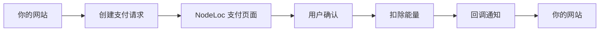
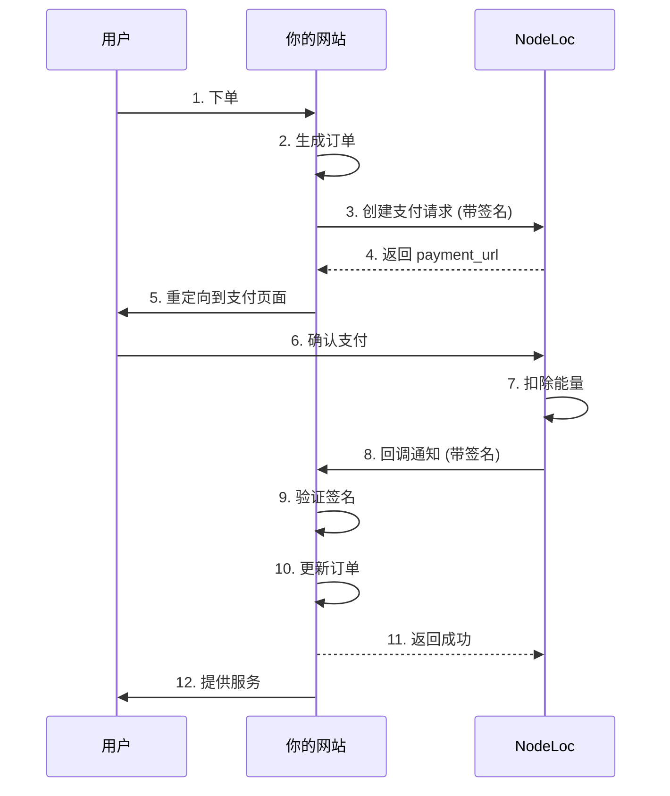

import { Callout } from '@/components/Callout'
import { CodeBlock } from '@/components/CodeBlock'
import { Tabs, Tab } from '@/components/Tabs'
import { Steps } from '@/components/Steps'

# NodeLoc Payment Plugin API 对接文档

本文档详细介绍如何将你的网站与 NodeLoc Payment Plugin 集成，实现能量支付功能。

## 目录

- [概述](#概述)
- [前置准备](#前置准备)
- [认证机制](#认证机制)
- [API 接口](#api-接口)
- [集成流程](#集成流程)
- [代码示例](#代码示例)
- [错误处理](#错误处理)
- [安全建议](#安全建议)

## 概述

NodeLoc Payment Plugin 提供了一个安全的支付接口，允许外部网站使用 NodeLoc 用户的能量进行支付。

### 核心概念

<dl>
  <dt><strong>Payment Application（支付应用）</strong></dt>
  <dd>你在 NodeLoc 上注册的应用，用于标识你的网站</dd>

  <dt><strong>Payment ID</strong></dt>
  <dd>应用的唯一标识符</dd>

  <dt><strong>Token</strong></dt>
  <dd>应用的密钥，用于生成签名</dd>

  <dt><strong>Signature（签名）</strong></dt>
  <dd>用于验证请求真实性的哈希值</dd>
</dl>

### 支付流程



<info>
  💡 **提示**: 整个支付流程采用 HMAC-SHA256 签名机制，确保交易安全可靠。
</info>

## 前置准备

<Steps>
  ### 创建支付应用

  1. 访问 NodeLoc 站点的 `/payment/applications` 页面
  2. 点击"新建支付应用"
  3. 填写以下信息：
     - **应用名称**: 你的网站名称
     - **网站 URL**: 你的网站地址
     - **回调 URL**: 接收支付结果的回调地址
     - **描述**: 应用说明（可选）
  4. 提交后会生成：
     - **Payment ID**: 如 `pay_a1b2c3d4e5f6...`
     - **Token**: 如 `tk_a1b2c3d4e5f6...`（仅显示一次，请务必保存）
  5. 等待管理员审批，审批通过后即可使用

  ### 保存凭证

  将 Payment ID 和 Token 保存到你的服务器配置中，例如：

  ```bash .env
  # .env 文件
  NODELOC_PAYMENT_ID=pay_a1b2c3d4e5f6...
  NODELOC_TOKEN=tk_a1b2c3d4e5f6...
  NODELOC_URL=https://www.nodeloc.com
  ```

  <warning>
    ⚠️ **安全提醒**: Token 是敏感信息，切勿泄露或提交到版本控制系统
  </warning>
</Steps>

## 认证机制

所有支付请求都需要使用签名进行验证，确保请求来自授权的应用。

### 签名生成算法

<success>
  🔒 **重要变更 (v1.0.1)**: 签名算法已从 SHA256 改为 **HMAC-SHA256**，提供更强的安全性。
</success>

签名生成步骤：

1. 对请求参数按键名字母顺序排序
2. 将参数拼接成 `key=value` 格式，用 `&` 连接
3. 使用 Token Hash 作为密钥，对参数字符串进行 HMAC-SHA256 加密
4. 得到的十六进制字符串即为签名

### Token Hash 生成

首次获得 Token 后，需要先计算其 SHA256 哈希值：

<Tabs>
  <Tab title="Tab">
    ```javascript
    const crypto = require('crypto');
    const tokenHash = crypto.createHash('sha256').update(token).digest('hex');
    ```
  </Tab>
  <Tab title="Tab">
    ```php
    $tokenHash = hash('sha256', $token);
    ```
  </Tab>
  <Tab title="Tab">
    ```python
    import hashlib
    token_hash = hashlib.sha256(token.encode()).hexdigest()
    ```
  </Tab>
</Tabs>

<info>
  **重要**: 保存 Token 和 Token Hash，后续签名使用 Token Hash。
</info>

### 签名示例

假设请求参数为：

```json
{
  "amount": 100,
  "description": "购买商品",
  "order_id": "ORDER123",
  "user_id": 5
}
```

- Token: `tk_secret`
- Token Hash: `9f86d081884c7d659a2feaa0c55ad015a3bf4f1b2b0b822cd15d6c15b0f00a08`

生成签名步骤：

```
1. 排序: amount, description, order_id, user_id
2. 拼接: amount=100&description=购买商品&order_id=ORDER123&user_id=5
3. HMAC-SHA256: 使用 Token Hash 作为密钥加密参数字符串
4. 结果: 得到签名的十六进制字符串
```

### 代码实现

<Tabs>
  <Tab title="Tab">
    ```javascript
    const crypto = require('crypto');
    
    function generateSignature(tokenHash, params) {
      // 1. 按键名排序
      const sortedKeys = Object.keys(params).sort();
      
      // 2. 拼接参数
      const paramString = sortedKeys
        .map(key => `${key}=${params[key]}`)
        .join('&');
      
      // 3. HMAC-SHA256 加密
      return crypto
        .createHmac('sha256', tokenHash)
        .update(paramString)
        .digest('hex');
    }
    
    // 使用示例
    const token = 'tk_secret';
    const tokenHash = crypto.createHash('sha256').update(token).digest('hex');
    const params = {
      amount: 100,
      description: '购买商品',
      order_id: 'ORDER123',
      user_id: 5
    };
    
    const signature = generateSignature(tokenHash, params);
    ```
  </Tab>
  <Tab title="Tab">
    ```php
    function generateSignature($tokenHash, $params) {
        // 按键名排序
        ksort($params);
        
        // 拼接参数
        $pairs = [];
        foreach ($params as $key => $value) {
            $pairs[] = $key . '=' . $value;
        }
        $paramString = implode('&', $pairs);
        
        // HMAC-SHA256 加密
        return hash_hmac('sha256', $paramString, $tokenHash);
    }
    ```
  </Tab>
  <Tab title="Tab">
    ```python
    import hashlib
    import hmac
    
    def generate_signature(token_hash, params):
        # 按键名排序
        sorted_params = sorted(params.items())
        
        # 拼接参数
        param_string = '&'.join([f'{k}={v}' for k, v in sorted_params])
        
        # HMAC-SHA256 加密
        return hmac.new(
            token_hash.encode(),
            param_string.encode(),
            hashlib.sha256
        ).hexdigest()
    ```
  </Tab>
</Tabs>

## API 接口

### 1. 创建支付

创建一个支付请求，返回支付页面 URL。

<div className="api-endpoint">
<span className="method post">
POST</span>

 <code>
/payment/pay/'{payment_id}'/process</code>

</div>

#### 请求参数

| 参数            | 类型      | 必填 | 说明                       |
| ------------- | ------- | --- | ------------------------ |
| `amount`      | Integer | ✅  | 支付金额（能量数量），必须大于 0        |
| `description` | String  | ✅  | 支付描述，最长 500 字符           |
| `order_id`    | String  | ✅  | 你的系统订单号，用于关联订单，最长 100 字符 |
| `user_id`     | Integer | ✅  | NodeLoc 用户 ID            |
| `signature`   | String  | ✅  | 请求签名                     |

#### 请求示例

```bash 创建支付请求
curl -X POST https://www.nodeloc.com/payment/pay/pay_a1b2c3d4/process \
  -H "Content-Type: application/json" \
  -d '{
    "amount": 100,
    "description": "购买VIP会员",
    "order_id": "ORDER_20250108_001",
    "user_id": 5,
    "signature": "abc123..."
  }'
```

#### 成功响应 (200 OK)

```json
{
  "payment_url": "https://www.nodeloc.com/payment/pay/txn_a1b2c3d4",
  "transaction_id": "txn_a1b2c3d4",
  "status": "pending",
  "amount": 100,
  "user_id": 5
}
```

#### 错误响应

```json
{
  "error": "Invalid signature",
  "message": "签名验证失败"
}
```

### 2. 查看支付详情

获取支付交易的详细信息（可选，用于查询支付状态）。

<div className="api-endpoint">
<span className="method get">
GET</span>

 <code>
/payment/pay/'{transaction_id}'</code>

</div>

#### 请求示例

```bash
curl https://www.nodeloc.com/payment/pay/txn_a1b2c3d4
```

#### 成功响应 (200 OK)

```json
{
  "transaction_id": "txn_a1b2c3d4",
  "payment_id": "pay_a1b2c3d4",
  "amount": 100,
  "description": "购买VIP会员",
  "order_id": "ORDER_20250108_001",
  "status": "completed",
  "user_id": 5,
  "created_at": "2025-01-08T10:30:00Z",
  "completed_at": "2025-01-08T10:32:00Z"
}
```

### 3. 支付回调

用户完成支付后，系统会向你的回调 URL 发送 POST 请求。

<div className="api-endpoint">
<span className="method post">
POST</span>

 <code>
你的回调 URL</code>

</div>

#### 回调参数

| 参数               | 类型      | 说明                                  |
| ---------------- | ------- | ----------------------------------- |
| `transaction_id` | String  | 交易ID                                |
| `order_id`       | String  | 你的订单号                               |
| `amount`         | Integer | 支付金额                                |
| `status`         | String  | 支付状态: `completed`（成功）或 `failed`（失败） |
| `user_id`        | Integer | 用户ID                                |
| `payment_id`     | String  | 应用ID                                |
| `signature`      | String  | 回调签名                                |

#### 回调示例

```json
{
  "transaction_id": "txn_a1b2c3d4",
  "order_id": "ORDER_20250108_001",
  "amount": 100,
  "status": "completed",
  "user_id": 5,
  "payment_id": "pay_a1b2c3d4",
  "signature": "xyz789..."
}
```

<warning>
  **验证回调签名**: 回调签名的生成方式与请求签名相同，你需要验证签名确保回调来自 NodeLoc。
</warning>

#### 你的响应

成功接收回调后，返回 200 状态码：

```json
{
  "success": true
}
```

## 集成流程

### 完整流程图



### 关键步骤说明

<Steps>
  ### 创建订单

  在你的数据库中创建订单记录

  ### 生成签名

  使用订单信息和 Token 生成签名

  ### 创建支付

  调用 NodeLoc API 获取支付链接

  ### 重定向用户

  将用户重定向到支付页面

  ### 处理回调

  验证回调签名并更新订单状态
</Steps>

## 代码示例

### PHP 完整示例

```php DiscoursePayment.php
<?php

class NodeLocPayment {
    private $paymentId;
    private $token;
    private $tokenHash;
    private $nodelocUrl;

    public function __construct($paymentId, $token, $nodelocUrl) {
        $this->paymentId = $paymentId;
        $this->token = $token;
        $this->tokenHash = hash('sha256', $token);
        $this->nodelocUrl = rtrim($nodelocUrl, '/');
    }

    /**
     * 生成 HMAC-SHA256 签名
     */
    private function generateSignature($params) {
        // 按键名排序
        ksort($params);

        // 拼接参数
        $pairs = [];
        foreach ($params as $key => $value) {
            $pairs[] = $key . '=' . $value;
        }
        $paramString = implode('&', $pairs);

        // 使用 Token Hash 进行 HMAC-SHA256 加密
        return hash_hmac('sha256', $paramString, $this->tokenHash);
    }

    /**
     * 创建支付
     */
    public function createPayment($userId, $amount, $description, $orderId) {
        $params = [
            'amount' => $amount,
            'description' => $description,
            'order_id' => $orderId,
            'user_id' => $userId,
        ];

        $signature = $this->generateSignature($params);
        $params['signature'] = $signature;

        $url = $this->nodelocUrl . '/payment/pay/' . $this->paymentId . '/process';

        $ch = curl_init($url);
        curl_setopt($ch, CURLOPT_RETURNTRANSFER, true);
        curl_setopt($ch, CURLOPT_POST, true);
        curl_setopt($ch, CURLOPT_POSTFIELDS, json_encode($params));
        curl_setopt($ch, CURLOPT_HTTPHEADER, [
            'Content-Type: application/json',
        ]);

        $response = curl_exec($ch);
        $httpCode = curl_getinfo($ch, CURLINFO_HTTP_CODE);
        curl_close($ch);

        if ($httpCode === 200) {
            return json_decode($response, true);
        } else {
            throw new Exception('Payment creation failed: ' . $response);
        }
    }

    /**
     * 验证回调签名
     */
    public function verifyCallback($data) {
        $signature = $data['signature'];
        unset($data['signature']);

        $expectedSignature = $this->generateSignature($data);
        return hash_equals($expectedSignature, $signature);
    }
}

// 使用示例

// 1. 创建支付
$payment = new NodeLocPayment(
    'pay_a1b2c3d4',
    'tk_secret',  // 原始 Token
    'https://www.nodeloc.com'
);

try {
    $result = $payment->createPayment(
        userId: 5,
        amount: 100,
        description: '购买VIP会员',
        orderId: 'ORDER_' . time()
    );

    // 重定向用户到支付页面
    header('Location: ' . $result['payment_url']);
    exit;
} catch (Exception $e) {
    echo 'Error: ' . $e->getMessage();
}

// 2. 处理回调（在 callback_url 对应的处理脚本中）
$callbackData = json_decode(file_get_contents('php://input'), true);

if ($payment->verifyCallback($callbackData)) {
    // 签名验证成功
    if ($callbackData['status'] === 'completed') {
        // 支付成功，更新订单状态
        // updateOrder($callbackData['order_id'], 'paid');
        echo json_encode(['success' => true]);
    } else {
        // 支付失败
        // updateOrder($callbackData['order_id'], 'failed');
        echo json_encode(['success' => true]);
    }
} else {
    // 签名验证失败
    http_response_code(400);
    echo json_encode(['error' => 'Invalid signature']);
}
```

### Python 完整示例

```python nodeloc_payment.py
import hashlib
import hmac
import requests
import json

class NodeLocPayment:
    def __init__(self, payment_id, token, nodeloc_url):
        self.payment_id = payment_id
        self.token = token
        # 计算 Token Hash
        self.token_hash = hashlib.sha256(token.encode()).hexdigest()
        self.nodeloc_url = nodeloc_url.rstrip('/')

    def generate_signature(self, params):
        """生成 HMAC-SHA256 签名"""
        # 按键名排序
        sorted_params = sorted(params.items())

        # 拼接参数
        param_string = '&'.join([f'{k}={v}' for k, v in sorted_params])

        # HMAC-SHA256 加密
        return hmac.new(
            self.token_hash.encode(),
            param_string.encode(),
            hashlib.sha256
        ).hexdigest()

    def create_payment(self, user_id, amount, description, order_id):
        """创建支付"""
        params = {
            'amount': amount,
            'description': description,
            'order_id': order_id,
            'user_id': user_id,
        }

        signature = self.generate_signature(params)
        params['signature'] = signature

        url = f'{self.nodeloc_url}/payment/pay/{self.payment_id}/process'

        response = requests.post(url, json=params)
        response.raise_for_status()

        return response.json()

    def verify_callback(self, data):
        """验证回调签名"""
        signature = data.pop('signature')
        expected_signature = self.generate_signature(data)
        return signature == expected_signature

# 使用示例
import time

payment = NodeLocPayment(
    payment_id='pay_a1b2c3d4',
    token='tk_secret',  # 原始 Token
    nodeloc_url='https://www.nodeloc.com'
)

# 创建支付
try:
    result = payment.create_payment(
        user_id=5,
        amount=100,
        description='购买VIP会员',
        order_id=f'ORDER_{int(time.time())}'
    )

    print(f"支付链接: {result['payment_url']}")
    # 重定向用户到 result['payment_url']
except Exception as e:
    print(f"错误: {e}")
```

### Node.js 完整示例

```javascript nodeloc-payment.js
const crypto = require('crypto');
const axios = require('axios');

class NodeLocPayment {
    constructor(paymentId, token, nodelocUrl) {
        this.paymentId = paymentId;
        this.token = token;
        // 计算 Token Hash
        this.tokenHash = crypto.createHash('sha256').update(token).digest('hex');
        this.nodelocUrl = nodelocUrl.replace(/\/$/, '');
    }

    /**
     * 生成 HMAC-SHA256 签名
     */
    generateSignature(params) {
        // 按键名排序
        const sortedKeys = Object.keys(params).sort();

        // 拼接参数
        const paramString = sortedKeys
            .map(key => `${key}=${params[key]}`)
            .join('&');

        // 使用 Token Hash 进行 HMAC-SHA256 加密
        return crypto
            .createHmac('sha256', this.tokenHash)
            .update(paramString)
            .digest('hex');
    }

    /**
     * 创建支付
     */
    async createPayment(userId, amount, description, orderId) {
        const params = {
            amount,
            description,
            order_id: orderId,
            user_id: userId,
        };

        const signature = this.generateSignature(params);
        params.signature = signature;

        const url = `${this.nodelocUrl}/payment/pay/${this.paymentId}/process`;

        try {
            const response = await axios.post(url, params, {
                headers: {
                    'Content-Type': 'application/json',
                }
            });

            return response.data;
        } catch (error) {
            throw new Error(`Payment creation failed: ${error.response?.data || error.message}`);
        }
    }

    /**
     * 验证回调签名
     */
    verifyCallback(data) {
        const signature = data.signature;
        delete data.signature;

        const expectedSignature = this.generateSignature(data);
        return signature === expectedSignature;
    }
}

// 使用示例
const payment = new NodeLocPayment(
    'pay_a1b2c3d4',
    'tk_secret',  // 原始 Token
    'https://www.nodeloc.com'
);

// Express 路由示例
const express = require('express');
const app = express();
app.use(express.json());

// 创建支付
app.post('/create-payment', async (req, res) => {
    try {
        const result = await payment.createPayment(
            req.body.userId,
            req.body.amount,
            req.body.description,
            `ORDER_${Date.now()}`
        );

        res.json({ paymentUrl: result.payment_url });
    } catch (error) {
        res.status(500).json({ error: error.message });
    }
});

// 处理回调
app.post('/payment/callback', (req, res) => {
    if (payment.verifyCallback(req.body)) {
        if (req.body.status === 'completed') {
            // 支付成功，更新订单
            console.log('Payment completed:', req.body.order_id);
        }
        res.json({ success: true });
    } else {
        res.status(400).json({ error: 'Invalid signature' });
    }
});
```

## 错误处理

### 常见错误码

| HTTP 状态码 | 错误信息                             | 说明     | 解决方案                   |
| -------- | -------------------------------- | ------ | ---------------------- |
| 400      | Invalid signature                | 签名验证失败 | 检查 Token 是否正确，签名算法是否正确 |
| 400      | Insufficient points              | 用户能量不足 | 提示用户充值能量               |
| 404      | Payment application not found    | 应用不存在  | 检查 Payment ID 是否正确     |
| 403      | Payment application not approved | 应用未批准  | 等待管理员批准应用              |
| 403      | Payment application suspended    | 应用已暂停  | 联系管理员恢复应用              |
| 422      | Invalid parameters               | 参数错误   | 检查请求参数是否完整且格式正确        |
| 500      | Internal server error            | 服务器错误  | 联系技术支持                 |

### 错误响应示例

```json
{
  "error": "Insufficient points",
  "message": "用户能量不足",
  "details": {
    "required": 100,
    "available": 50
  }
}
```

## 安全建议

### 1. Token 安全

<div className="security-checklist">
- ✅ 将 Token 存储在服务器端，不要暴露给客户端
- ✅ 使用环境变量或加密配置文件存储 Token
- ✅ 定期轮换 Token（使用"重新生成 Token"功能）
- ❌ 不要将 Token 提交到版本控制系统
- ❌ 不要在前端 JavaScript 中使用 Token

</div>

### 2. 回调验证

<div className="security-checklist">
- ✅ 始终验证回调签名
- ✅ 验证回调来源 IP（可选）
- ✅ 使用 HTTPS 接收回调
- ✅ 实现幂等性处理，防止重复处理同一回调

</div>

### 3. 金额验证

<div className="security-checklist">
- ✅ 在服务器端验证支付金额
- ✅ 检查订单金额与回调金额是否一致
- ❌ 不要信任客户端传递的金额

</div>

### 4. 订单号

<div className="security-checklist">
- ✅ 使用唯一的订单号
- ✅ 在回调中验证订单号的有效性
- ✅ 防止订单号被重复使用

</div>

### 5. 网络安全

<div className="security-checklist">
- ✅ 使用 HTTPS 进行所有通信
- ✅ 实现请求频率限制
- ✅ 记录所有支付请求和回调日志

</div>

## 测试建议

<info>
  **最佳实践**: 在生产环境上线前，务必在测试环境完成充分的测试。
</info>

1. **测试环境**: 先在测试环境完成集成和测试
2. **小额测试**: 使用小额能量进行测试
3. **异常情况**: 测试能量不足、签名错误等异常情况
4. **并发测试**: 测试并发支付请求
5. **回调测试**: 确保回调处理正确

---

<style jsx>
  {`
  .api-endpoint {
    display: flex;
    align-items: center;
    gap: 0.5rem;
    margin: 1rem 0;
    padding: 1rem;
    background: #f6f8fa;
    border-radius: 6px;
    font-family: monospace;
  }

  .method {
    padding: 0.25rem 0.5rem;
    border-radius: 4px;
    font-weight: bold;
    font-size: 0.875rem;
    text-transform: uppercase;
  }

  .method.post {
    background: #10b981;
    color: white;
  }

  .method.get {
    background: #3b82f6;
    color: white;
  }

  .security-checklist {
    background: #f9fafb;
    border-left: 4px solid #3b82f6;
    padding: 1rem 1.5rem;
    margin: 1rem 0;
  }

  .security-checklist li {
    margin: 0.5rem 0;
  }

  .changelog {
    border-left: 4px solid #10b981;
    padding-left: 1.5rem;
    margin: 2rem 0;
  }

  .changelog h3 {
    color: #059669;
    margin-top: 1.5rem;
  }

  .footer-note {
    text-align: center;
    color: #6b7280;
    font-size: 0.875rem;
    margin-top: 3rem;
    padding-top: 2rem;
    border-top: 1px solid #e5e7eb;
  }

  dl {
    margin: 1rem 0;
  }

  dt {
    margin-top: 1rem;
    color: #1f2937;
  }

  dd {
    margin-left: 1.5rem;
    color: #6b7280;
  }
  `}
</style>