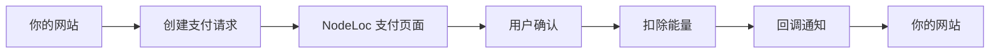
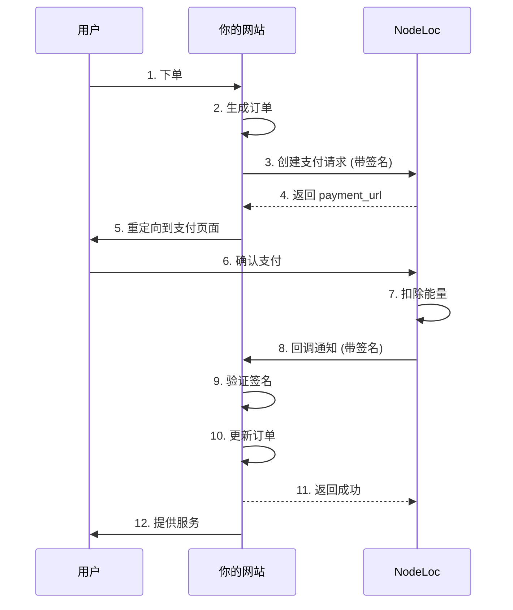

import { Callout } from '@/components/Callout'
import { CodeBlock } from '@/components/CodeBlock'
import { Tabs, Tab } from '@/components/Tabs'
import { Steps } from '@/components/Steps'

# NodeLoc Payment Plugin API 对接文档

本文档详细介绍如何将你的网站与 NodeLoc Payment Plugin 集成，实现能量支付功能。

## 目录

- [概述](#概述)
- [前置准备](#前置准备)
- [认证机制](#认证机制)
- [API 接口](#api-接口)
- [集成流程](#集成流程)
- [代码示例](#代码示例)
- [错误处理](#错误处理)
- [安全建议](#安全建议)

## 概述

NodeLoc Payment Plugin 提供了一个安全的支付接口，允许外部网站使用 NodeLoc 用户的能量进行支付。

### 核心概念

<dl>
  <dt><strong>Payment Application（支付应用）</strong></dt>
  <dd>你在 NodeLoc 上注册的应用，用于标识你的网站</dd>

  <dt><strong>Payment ID</strong></dt>
  <dd>应用的唯一标识符</dd>

  <dt><strong>Token</strong></dt>
  <dd>应用的密钥，用于生成签名</dd>

  <dt><strong>Signature（签名）</strong></dt>
  <dd>用于验证请求真实性的哈希值</dd>
</dl>

### 支付流程



<Callout>
  💡 **提示**: 整个支付流程采用 HMAC-SHA256 签名机制，确保交易安全可靠。
</Callout>

## 前置准备

<Steps>
  ### 创建支付应用

  1. 访问 NodeLoc 站点的 `/payment/applications` 页面
  2. 点击"新建支付应用"
  3. 填写以下信息：
     - **应用名称**: 你的网站名称
     - **网站 URL**: 你的网站地址
     - **回调 URL**: 接收支付结果的回调地址
     - **描述**: 应用说明（可选）
  4. 提交后会生成：
     - **Payment ID**: 如 `pay_a1b2c3d4e5f6...`
     - **Token**: 如 `tk_a1b2c3d4e5f6...`（仅显示一次，请务必保存）
  5. 等待管理员审批，审批通过后即可使用

  ### 保存凭证

  将 Payment ID 和 Token 保存到你的服务器配置中，例如：

  ```bash .env
  # .env 文件
  NODELOC_PAYMENT_ID=pay_a1b2c3d4e5f6...
  NODELOC_TOKEN=tk_a1b2c3d4e5f6...
  NODELOC_URL=https://www.nodeloc.com
  ```

  <Callout type="warning">
    ⚠️ **安全提醒**: Token 是敏感信息，切勿泄露或提交到版本控制系统
  </Callout>
</Steps>

## 认证机制

所有支付请求都需要使用签名进行验证，确保请求来自授权的应用。

### 签名生成算法

<Callout type="success">
  🔒 **重要变更 (v1.0.1)**: 签名算法已从 SHA256 改为 **HMAC-SHA256**，提供更强的安全性。
</Callout>

签名生成步骤：

1. 对请求参数按键名字母顺序排序
2. 将参数拼接成 `key=value` 格式，用 `&` 连接
3. 使用 Token Hash 作为密钥，对参数字符串进行 HMAC-SHA256 加密
4. 得到的十六进制字符串即为签名

### Token Hash 生成

首次获得 Token 后，需要先计算其 SHA256 哈希值：

<Tabs>
  <Tab title="Tab">
    ```javascript
    const crypto = require('crypto');
    const tokenHash = crypto.createHash('sha256').update(token).digest('hex');
    ```
  </Tab>
  <Tab title="Tab">
    ```php
    $tokenHash = hash('sha256', $token);
    ```
  </Tab>
  <Tab title="Tab">
    ```python
    import hashlib
    token_hash = hashlib.sha256(token.encode()).hexdigest()
    ```
  </Tab>
</Tabs>

<Callout>
  **重要**: 保存 Token 和 Token Hash，后续签名使用 Token Hash。
</Callout>

### 签名示例

假设请求参数为：

```json
{
  "amount": 100,
  "description": "购买商品",
  "order_id": "ORDER123",
  "user_id": 5
}
```

- Token: `tk_secret`
- Token Hash: `9f86d081884c7d659a2feaa0c55ad015a3bf4f1b2b0b822cd15d6c15b0f00a08`

生成签名步骤：

```
1. 排序: amount, description, order_id, user_id
2. 拼接: amount=100&description=购买商品&order_id=ORDER123&user_id=5
3. HMAC-SHA256: 使用 Token Hash 作为密钥加密参数字符串
4. 结果: 得到签名的十六进制字符串
```

### 代码实现

<Tabs>
  <Tab title="Tab">
    ```javascript
    const crypto = require('crypto');
    
    function generateSignature(tokenHash, params) {
      // 1. 按键名排序
      const sortedKeys = Object.keys(params).sort();
      
      // 2. 拼接参数
      const paramString = sortedKeys
        .map(key => `${key}=${params[key]}`)
        .join('&');
      
      // 3. HMAC-SHA256 加密
      return crypto
        .createHmac('sha256', tokenHash)
        .update(paramString)
        .digest('hex');
    }
    
    // 使用示例
    const token = 'tk_secret';
    const tokenHash = crypto.createHash('sha256').update(token).digest('hex');
    const params = {
      amount: 100,
      description: '购买商品',
      order_id: 'ORDER123',
      user_id: 5
    };
    
    const signature = generateSignature(tokenHash, params);
    ```
  </Tab>
  <Tab title="Tab">
    ```php
    function generateSignature($tokenHash, $params) {
        // 按键名排序
        ksort($params);
        
        // 拼接参数
        $pairs = [];
        foreach ($params as $key => $value) {
            $pairs[] = $key . '=' . $value;
        }
        $paramString = implode('&', $pairs);
        
        // HMAC-SHA256 加密
        return hash_hmac('sha256', $paramString, $tokenHash);
    }
    ```
  </Tab>
  <Tab title="Tab">
    ```python
    import hashlib
    import hmac
    
    def generate_signature(token_hash, params):
        # 按键名排序
        sorted_params = sorted(params.items())
        
        # 拼接参数
        param_string = '&'.join([f'{k}={v}' for k, v in sorted_params])
        
        # HMAC-SHA256 加密
        return hmac.new(
            token_hash.encode(),
            param_string.encode(),
            hashlib.sha256
        ).hexdigest()
    ```
  </Tab>
</Tabs>

## API 接口

### 1. 创建支付

创建一个支付请求，返回支付页面 URL。

<div className="api-endpoint">
<span className="method post">POST</span> <code>/payment/pay/{payment_id}/process</code>
</div>

#### 请求参数

| 参数            | 类型      | 必填 | 说明                       |
| ------------- | ------- | --- | ------------------------ |
| `amount`      | Integer | ✅  | 支付金额（能量数量），必须大于 0        |
| `description` | String  | ✅  | 支付描述，最长 500 字符           |
| `order_id`    | String  | ✅  | 你的系统订单号，用于关联订单，最长 100 字符 |
| `user_id`     | Integer | ✅  | NodeLoc 用户 ID            |
| `signature`   | String  | ✅  | 请求签名                     |

#### 请求示例

```bash 创建支付请求
curl -X POST https://www.nodeloc.com/payment/pay/pay_a1b2c3d4/process \
  -H "Content-Type: application/json" \
  -d '{
    "amount": 100,
    "description": "购买VIP会员",
    "order_id": "ORDER_20250108_001",
    "user_id": 5,
    "signature": "abc123..."
  }'
```

#### 成功响应 (200 OK)

```json
{
  "payment_url": "https://www.nodeloc.com/payment/pay/txn_a1b2c3d4",
  "transaction_id": "txn_a1b2c3d4",
  "status": "pending",
  "amount": 100,
  "user_id": 5
}
```

#### 错误响应

```json
{
  "error": "Invalid signature",
  "message": "签名验证失败"
}
```

### 2. 查看支付详情

获取支付交易的详细信息（可选，用于查询支付状态）。

<div className="api-endpoint">
<span className="method get">GET</span> <code>/payment/pay/{transaction_id}</code>
</div>

#### 请求示例

```bash
curl https://www.nodeloc.com/payment/pay/txn_a1b2c3d4
```

#### 成功响应 (200 OK)

```json
{
  "transaction_id": "txn_a1b2c3d4",
  "payment_id": "pay_a1b2c3d4",
  "amount": 100,
  "description": "购买VIP会员",
  "order_id": "ORDER_20250108_001",
  "status": "completed",
  "user_id": 5,
  "created_at": "2025-01-08T10:30:00Z",
  "completed_at": "2025-01-08T10:32:00Z"
}
```

### 3. 支付回调

用户完成支付后，系统会向你的回调 URL 发送 POST 请求。

<div className="api-endpoint">
<span className="method post">POST</span> <code>你的回调 URL</code>
</div>

#### 回调参数

| 参数               | 类型      | 说明                                  |
| ---------------- | ------- | ----------------------------------- |
| `transaction_id` | String  | 交易ID                                |
| `order_id`       | String  | 你的订单号                               |
| `amount`         | Integer | 支付金额                                |
| `status`         | String  | 支付状态: `completed`（成功）或 `failed`（失败） |
| `user_id`        | Integer | 用户ID                                |
| `payment_id`     | String  | 应用ID                                |
| `signature`      | String  | 回调签名                                |

#### 回调示例

```json
{
  "transaction_id": "txn_a1b2c3d4",
  "order_id": "ORDER_20250108_001",
  "amount": 100,
  "status": "completed",
  "user_id": 5,
  "payment_id": "pay_a1b2c3d4",
  "signature": "xyz789..."
}
```

<Callout type="warning">
  **验证回调签名**: 回调签名的生成方式与请求签名相同，你需要验证签名确保回调来自 NodeLoc。
</Callout>

#### 你的响应

成功接收回调后，返回 200 状态码：

```json
{
  "success": true
}
```

## 集成流程

### 完整流程图



### 关键步骤说明

<Steps>
  ### 创建订单

  在你的数据库中创建订单记录

  ### 生成签名

  使用订单信息和 Token 生成签名

  ### 创建支付

  调用 NodeLoc API 获取支付链接

  ### 重定向用户

  将用户重定向到支付页面

  ### 处理回调

  验证回调签名并更新订单状态
</Steps>

## 代码示例

### PHP 完整示例

```php DiscoursePayment.php
<?php

class NodeLocPayment {
```