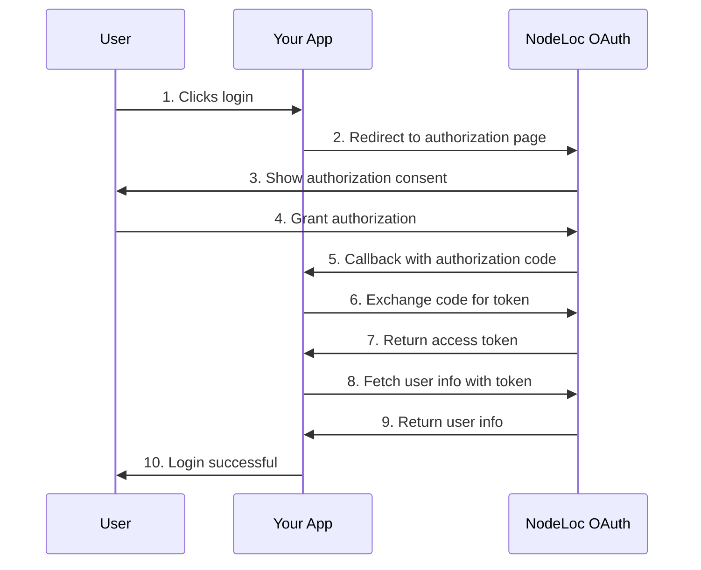

# OAuth Integration Guide

This document provides a complete third-party app integration guide to help you integrate the NodeLoc OAuth Provider into your application.

## 📋 Table of contents

- [Quick start](#quick-start)
- [OAuth 2.0 authorization flow](#oauth-20-authorization-flow)
- [API endpoints](#api-endpoints)
- [Integration examples](#integration-examples)
- [FAQ](#faq)

## 🚀 Quick start

### 1. Create an OAuth app

Visit the NodeLoc forum and create an OAuth app (requires Gold member TL2 or above):

```
https://www.nodeloc.com/oauth-provider/applications
```

<Frame>
  
</Frame>

Record the following information:
- **Client ID**: the unique identifier of your app
- **Client Secret**: the app secret (shown only once — store it safely)
- **Redirect URI**: the callback URL after authorization

<Note>
  If the app requests the `email` scope, it must be reviewed by an admin before it can be used.
</Note>

### 2. Configure environment variables

```bash
NodeLoc_URL=https://www.nodeloc.com
NodeLoc_CLIENT_ID=your-client-id
NodeLoc_CLIENT_SECRET=your-client-secret
NodeLoc_REDIRECT_URI=http://your-url.com/auth/callback
```

### 3. Start integrating

Choose your development language and refer to the integration examples below to get started quickly.

---

## 🔐 OAuth 2.0 authorization flow

### Flow diagram



### Detailed steps

#### Step 1: Redirect to the authorization page

Redirect the user to the following URL:

```
https://www.nodeloc.com/oauth-provider/authorize?
  client_id=YOUR_CLIENT_ID&
  redirect_uri=YOUR_REDIRECT_URI&
  response_type=code&
  scope=openid%20profile%20email&
  state=RANDOM_STATE_STRING
```

**Parameter description:**

| Parameter | Required | Description |
|------|------|------|
| `client_id` | ✓ | Your app's Client ID |
| `redirect_uri` | ✓ | The callback URL after authorization (must match the app configuration) |
| `response_type` | ✓ | Fixed value: `code` |
| `scope` | - | Requested permission scopes, e.g. `openid profile email` (see details below) |
| `state` | Recommended | A random string used to prevent CSRF attacks |

**Available scopes:**

| Scope | Description | Required | Needs review |
|-------|------|----------|----------|
| `openid` | Standard OpenID Connect scope | **Yes (required)** | No |
| `profile` | User profile (avatar, bio, etc.) | No | No |
| `email` | User email address | No | **Yes** |

**Notes:**
- If the app requests the `email` scope, it must be reviewed by an admin before it can be used
- The review status can be viewed on the app management page
- Apps that have not passed review cannot complete the authorization flow

#### Step 2: Receive the authorization code

After the user authorizes, NodeLoc redirects back to your `redirect_uri` with an authorization code:

**Authorization successful:**
```
https://your-app.com/callback?
  code=AUTHORIZATION_CODE&
  state=YOUR_STATE_STRING
```

**User denied authorization:**
```
https://your-app.com/callback?
  error=access_denied&
  error_description=The+resource+owner+or+authorization+server+denied+the+request&
  state=YOUR_STATE_STRING
```

**Error parameter description:**

| Parameter | Description |
|------|------|
| `error` | Error code; `access_denied` means the user denied authorization |
| `error_description` | Error description |
| `state` | The state parameter you sent in step 1 |

**Handling recommendations:**
- Check for the presence of an `error` parameter to determine whether authorization succeeded
- If the user denies authorization, prompt them in a friendly way and offer an option to authorize again
- Log denial events to analyze user behavior

**Example code (Node.js):**
```javascript
app.get('/callback', (req, res) => {
  const { code, error, error_description, state } = req.query;
  
  // Verify the state parameter
  if (state !== req.session.oauthState) {
    return res.status(400).send('Invalid state parameter');
  }
  
  // Check for errors
  if (error) {
    if (error === 'access_denied') {
      // User denied authorization
      return res.send(`
        <h1>Authorization denied</h1>
        <p>You denied the authorization request. To use this service, please <a href="/auth/NodeLoc">authorize again</a>.</p>
      `);
    }
    // Other errors
    return res.status(400).send(`Authorization error: ${error_description || error}`);
  }
  
  // Continue handling the authorization code...
});
```

**Security tip:** Verify that the `state` parameter matches the one sent in step 1.

#### Step 3: Exchange for an Access Token

Exchange the authorization code for an Access Token:

```bash
curl -X POST https://www.nodeloc.com/oauth-provider/token \
  -H "Content-Type: application/x-www-form-urlencoded" \
  -d "grant_type=authorization_code" \
  -d "code=AUTHORIZATION_CODE" \
  -d "redirect_uri=YOUR_REDIRECT_URI" \
  -d "client_id=YOUR_CLIENT_ID" \
  -d "client_secret=******************"
```

**Example response:**

```json
{
  "access_token": "***************************************",
  "token_type": "Bearer",
  "expires_in": 7200,
  "refresh_token": "optional_refresh_token",
  "scope": "openid profile email"
}
```

#### Step 4: Get user info

Use the Access Token to get user info:

```bash
curl -X GET https://www.nodeloc.com/oauth-provider/userinfo \
  -H "Authorization: Bearer ACCESS_TOKEN"
```

**Example response:**

```json
{
  "id": 123,
  "username": "user1",
  "name": "user1",
  "avatar_url": "https://NodeLoc.com/avatar.png",
  "trust_level": 2,
  "email": "user1@example.com"
}
```

**Field description:**

| Field | Type | Description |
|------|------|------|
| `id` | integer | The user's unique identifier |
| `username` | string | Username |
| `name` | string | Display name (falls back to username if empty) |
| `avatar_url` | string | User avatar URL |
| `trust_level` | integer | User trust level (0-4) |
| `email` | string | User email (returned only when the scope includes `email`) |

---

## 🔌 API endpoints

### Authorization endpoint

```
GET /oauth-provider/authorize
```

Used to initiate an authorization request; the user visits this endpoint in a browser.

### Token endpoint

```
POST /oauth-provider/token
```

Used to exchange an authorization code for an Access Token, or to refresh an access token with a Refresh Token.

**Supported grant types:**
- `authorization_code` - authorization code flow
- `refresh_token` - refresh token (if supported)

### UserInfo endpoint

```
GET /oauth-provider/userinfo
```

Use an Access Token to get the currently authorized user's info.

**Request header:**
```
Authorization: Bearer YOUR_ACCESS_TOKEN
```

### OIDC Discovery endpoint (optional)

```
GET /.well-known/openid-configuration
```

Returns OIDC configuration information, supporting auto-discovery.

---

## 💻 Integration examples

### Node.js + Express

#### Install dependencies

```bash
npm install express express-session passport passport-oauth2
```

#### Full example code

```javascript
const express = require('express');
const session = require('express-session');
const passport = require('passport');
const OAuth2Strategy = require('passport-oauth2');

const app = express();

// Configure session
app.use(session({
  secret: 'your-secret-key',
  resave: false,
  saveUninitialized: false,
  cookie: { secure: false } // Set to true in production
}));

app.use(passport.initialize());
app.use(passport.session());

// Configure the NodeLoc OAuth2 strategy
passport.use('NodeLoc', new OAuth2Strategy({
    authorizationURL: `${process.env.NodeLoc_URL}/oauth-provider/authorize`,
    tokenURL: `${process.env.NodeLoc_URL}/oauth-provider/token`,
    clientID: process.env.NodeLoc_CLIENT_ID,
    clientSecret: process.env.NodeLoc_CLIENT_SECRET,
    callbackURL: process.env.NodeLoc_REDIRECT_URI,
    scope: ['openid', 'profile', 'email']
  },
  async (accessToken, refreshToken, profile, done) => {
    try {
      // Fetch user info
      const response = await fetch(
        `${process.env.NodeLoc_URL}/oauth-provider/userinfo`,
        {
          headers: {
            'Authorization': `Bearer ${accessToken}`
          }
        }
      );
      
      const user = await response.json();
      
      // Save the access_token on the user object
      user.accessToken = accessToken;
      user.refreshToken = refreshToken;
      
      return done(null, user);
    } catch (error) {
      return done(error);
    }
  }
));

// Serialize and deserialize the user
passport.serializeUser((user, done) => {
  done(null, user);
});

passport.deserializeUser((user, done) => {
  done(null, user);
});

// Routes

// Homepage - shows login status
app.get('/', (req, res) => {
  if (req.isAuthenticated()) {
    res.send(`
      <!DOCTYPE html>
      <html>
        <head>
          <meta charset="utf-8">
          <title>Welcome</title>
          <style>
            body {
              font-family: Arial, sans-serif;
              max-width: 600px;
              margin: 50px auto;
              padding: 20px;
            }
            .user-card {
              border: 1px solid #ddd;
              border-radius: 8px;
              padding: 20px;
              background: #f9f9f9;
            }
            .avatar {
              width: 80px;
              height: 80px;
              border-radius: 50%;
            }
            .logout-btn {
              background: #dc3545;
              color: white;
              padding: 10px 20px;
              text-decoration: none;
              border-radius: 4px;
              display: inline-block;
              margin-top: 15px;
            }
          </style>
        </head>
        <body>
          <div class="user-card">
            <h1>Welcome, ${req.user.name}!</h1>
            
            <p><strong>Username:</strong> ${req.user.username}</p>
            <p><strong>User ID:</strong> ${req.user.id}</p>
            <p><strong>Trust level:</strong> ${req.user.trust_level}</p>
            <a href="/logout" class="logout-btn">Log out</a>
          </div>
        </body>
      </html>
    `);
  } else {
    res.send(`
      <!DOCTYPE html>
      <html>
        <head>
          <meta charset="utf-8">
          <title>Login</title>
          <style>
            body {
              font-family: Arial, sans-serif;
              display: flex;
              justify-content: center;
              align-items: center;
              height: 100vh;
              margin: 0;
            }
            .login-btn {
              background: #0088cc;
              color: white;
              padding: 15px 30px;
              text-decoration: none;
              border-radius: 4px;
              font-size: 18px;
            }
            .login-btn:hover {
              background: #006699;
            }
          </style>
        </head>
        <body>
          <a href="/auth/NodeLoc" class="login-btn">Log in with NodeLoc</a>
        </body>
      </html>
    `);
  }
});

// Initiate authorization
app.get('/auth/NodeLoc', passport.authenticate('NodeLoc'));

// Authorization callback
app.get('/auth/callback',
  passport.authenticate('NodeLoc', { failureRedirect: '/login' }),
  (req, res) => {
    // Login successful, redirect to homepage
    res.redirect('/');
  }
);

// Log out
app.get('/logout', (req, res) => {
  req.logout((err) => {
    if (err) {
      return res.redirect('/');
    }
    res.redirect('/');
  });
});

// API example - get current user
app.get('/api/me', (req, res) => {
  if (!req.isAuthenticated()) {
    return res.status(401).json({ error: 'Not authenticated' });
  }
  
  res.json({
    id: req.user.id,
    username: req.user.username,
    name: req.user.name,
    avatar_url: req.user.avatar_url,
    trust_level: req.user.trust_level
  });
});

// Start the server
const PORT = process.env.PORT || 3000;
app.listen(PORT, () => {
  console.log(`Server running at http://localhost:${PORT}`);
  console.log(`Make sure the following environment variables are set:`);
  console.log(`  - NodeLoc_URL`);
  console.log(`  - NodeLoc_CLIENT_ID`);
  console.log(`  - NodeLoc_CLIENT_SECRET`);
  console.log(`  - NodeLoc_REDIRECT_URI`);
});
```

#### Environment variable configuration

Create a `.env` file:

```bash
NodeLoc_URL=https://www.nodeloc.com
NodeLoc_CLIENT_ID=your-client-id
NodeLoc_CLIENT_SECRET=your-client-secret
NodeLoc_REDIRECT_URI=http://your-url.com/auth/callback
PORT=3000
```

#### Run the app

```bash
node app.js
```

Visit `http://your-url.com` to see the login page.

---

### Python + Flask

#### Install dependencies

```bash
pip install flask authlib requests
```

#### Full example code

```python
from flask import Flask, redirect, url_for, session, jsonify
from authlib.integrations.flask_client import OAuth
import os

app = Flask(__name__)
app.secret_key = os.urandom(24)

# Configure OAuth
oauth = OAuth(app)

NodeLoc = oauth.register(
    name='NodeLoc',
    client_id=os.getenv('NodeLoc_CLIENT_ID'),
    client_secret=os.getenv('NodeLoc_CLIENT_SECRET'),
    authorize_url=f"{os.getenv('NodeLoc_URL')}/oauth-provider/authorize",
    access_token_url=f"{os.getenv('NodeLoc_URL')}/oauth-provider/token",
    userinfo_endpoint=f"{os.getenv('NodeLoc_URL')}/oauth-provider/userinfo",
    client_kwargs={
        'scope': 'openid profile email'
    }
)

@app.route('/')
def index():
    """Homepage - shows login status"""
    user = session.get('user')
    
    if user:
        return f'''
            <!DOCTYPE html>
            <html>
                <head>
                    <meta charset="utf-8">
                    <title>Welcome</title>
                    <style>
                        body {{
                            font-family: Arial, sans-serif;
                            max-width: 600px;
                            margin: 50px auto;
                            padding: 20px;
                        }}
                        .user-card {{
                            border: 1px solid #ddd;
                            border-radius: 8px;
                            padding: 20px;
                            background: #f9f9f9;
                        }}
                        .avatar {{
                            width: 80px;
                            height: 80px;
                            border-radius: 50%;
                        }}
                        .logout-btn {{
                            background: #dc3545;
                            color: white;
                            padding: 10px 20px;
                            text-decoration: none;
                            border-radius: 4px;
                            display: inline-block;
                            margin-top: 15px;
                        }}
                    </style>
                </head>
                <body>
                    <div class="user-card">
                        <h1>Welcome, {user['name']}!</h1>
                        
                        <p><strong>Username:</strong> {user['username']}</p>
                        <p><strong>User ID:</strong> {user['id']}</p>
                        <p><strong>Trust level:</strong> {user['trust_level']}</p>
                        <a href="/logout" class="logout-btn">Log out</a>
                    </div>
                </body>
            </html>
        '''
    
    return '''
        <!DOCTYPE html>
        <html>
            <head>
                <meta charset="utf-8">
                <title>Login</title>
                <style>
                    body {
                        font-family: Arial, sans-serif;
                        display: flex;
                        justify-content: center;
                        align-items: center;
                        height: 100vh;
                        margin: 0;
                    }
                    .login-btn {
                        background: #0088cc;
                        color: white;
                        padding: 15px 30px;
                        text-decoration: none;
                        border-radius: 4px;
                        font-size: 18px;
                    }
                    .login-btn:hover {
                        background: #006699;
                    }
                </style>
            </head>
            <body>
                <a href="/login" class="login-btn">Log in with NodeLoc</a>
            </body>
        </html>
    '''

@app.route('/login')
def login():
    """Initiate authorization"""
    redirect_uri = url_for('authorize', _external=True)
    return NodeLoc.authorize_redirect(redirect_uri)

@app.route('/authorize')
def authorize():
    """Authorization callback"""
    token = NodeLoc.authorize_access_token()
    
    # Fetch user info
    resp = NodeLoc.get('/oauth-provider/userinfo', token=token)
    user = resp.json()
    
    # Save to session
    session['user'] = user
    session['token'] = token
    
    return redirect('/')

@app.route('/logout')
def logout():
    """Log out"""
    session.pop('user', None)
    session.pop('token', None)
    return redirect('/')

@app.route('/api/me')
def api_me():
    """API example - get current user"""
    user = session.get('user')
    
    if not user:
        return jsonify({'error': 'Not authenticated'}), 401
    
    return jsonify({
        'id': user['id'],
        'username': user['username'],
        'name': user['name'],
        'avatar_url': user['avatar_url'],
        'trust_level': user['trust_level']
    })

if __name__ == '__main__':
    # Check environment variables
    required_vars = ['NodeLoc_URL', 'NodeLoc_CLIENT_ID', 'NodeLoc_CLIENT_SECRET']
    missing_vars = [var for var in required_vars if not os.getenv(var)]
    
    if missing_vars:
        print(f"Error: missing environment variables: {', '.join(missing_vars)}")
        exit(1)
    
    print("Server running at http://localhost:5000")
    app.run(debug=True)
```

#### Run the app

```bash
export NodeLoc_URL=https://www.nodeloc.com
export NodeLoc_CLIENT_ID=your-client-id
export NodeLoc_CLIENT_SECRET=your-client-secret

python app.py
```

---

### Ruby on Rails + Devise

#### Gemfile

```ruby
gem 'devise'
gem 'omniauth'
gem 'omniauth-oauth2'
gem 'omniauth-rails_csrf_protection'
```

#### config/initializers/devise.rb

```ruby
Devise.setup do |config|
  config.omniauth :NodeLoc,
    ENV['NodeLoc_CLIENT_ID'],
    ENV['NodeLoc_CLIENT_SECRET'],
    {
      client_options: {
        site: ENV['NodeLoc_URL'],
        authorize_url: '/oauth-provider/authorize',
        token_url: '/oauth-provider/token'
      },
      scope: 'openid profile email'
    }
end
```

#### app/models/user.rb

```ruby
class User < ApplicationRecord
  devise :omniauthable, omniauth_providers: [:NodeLoc]
  
  def self.from_omniauth(auth)
    where(provider: auth.provider, uid: auth.uid).first_or_create do |user|
      user.email = auth.info.email || "#{auth.uid}@NodeLoc.local"
      user.username = auth.info.username
      user.name = auth.info.name
      user.avatar_url = auth.info.image
      user.password = Devise.friendly_token[0, 20]
    end
  end
end
```

#### app/controllers/users/omniauth_callbacks_controller.rb

```ruby
class Users::OmniauthCallbacksController < Devise::OmniauthCallbacksController
  def NodeLoc
    @user = User.from_omniauth(request.env['omniauth.auth'])

    if @user.persisted?
      sign_in_and_redirect @user, event: :authentication
      set_flash_message(:notice, :success, kind: 'NodeLoc') if is_navigational_format?
    else
      session['devise.NodeLoc_data'] = request.env['omniauth.auth'].except(:extra)
      redirect_to new_user_registration_url
    end
  end

  def failure
    redirect_to root_path
  end
end
```

---

## ❓ FAQ

### 1. How do I handle token expiry?

Access Tokens are valid for 2 hours (7200 seconds) by default. After expiry, the user must authorize again, or use a Refresh Token (if supported).

```javascript
// Check whether the token has expired
function isTokenExpired(expiresAt) {
  return Date.now() >= expiresAt * 1000;
}

// Refresh with a Refresh Token
async function refreshAccessToken(refreshToken) {
  const response = await fetch(`${NodeLoc_URL}/oauth-provider/token`, {
    method: 'POST',
    headers: {
      'Content-Type': 'application/x-www-form-urlencoded'
    },
    body: new URLSearchParams({
      grant_type: 'refresh_token',
      refresh_token: refreshToken,
      client_id: CLIENT_ID,
      client_secret: CLIENT_SECRET
    })
  });
  
  return await response.json();
}
```

### 2. How do I handle errors?

All errors are returned in the standard OAuth 2.0 error format:

```json
{
  "error": "invalid_client",
  "error_description": "Invalid client credentials"
}
```

**Common error codes:**

| Error code | Description | Solution |
|---------|------|---------|
| `invalid_request` | Missing or invalid request parameters | Check required parameters |
| `invalid_client` | Invalid Client ID or Secret | Verify app credentials |
| `invalid_grant` | Invalid or expired authorization code | Restart authorization |
| `unauthorized_client` | Client not authorized | Check app status |
| `unsupported_grant_type` | Unsupported grant type | Use `authorization_code` |
| `invalid_token` | Invalid Access Token | Obtain a new token |

### 3. What if the name field is empty?

When a user hasn't set a display name, the `name` field automatically falls back to the `username` value. No extra handling is needed.

```javascript
// UserInfo response example (when name is empty)
{
  "id": 123,
  "username": "user1",
  "name": "user1",  // Automatically falls back to username
  "avatar_url": "...",
  "trust_level": 1
}
```

### 4. How do I test the OAuth integration?

Use the following test script for quick verification:

```bash
# 1. Visit the authorization URL in a browser
https://www.nodeloc.com/oauth-provider/authorize?client_id=YOUR_ID&redirect_uri=http://your-url.com/callback&response_type=code&state=test

# 2. Get the code after authorizing, then exchange it for a token
curl -X POST https://www.nodeloc.com/oauth-provider/token \
  -d "grant_type=authorization_code" \
  -d "code=YOUR_CODE" \
  -d "redirect_uri=http://your-url.com/callback" \
  -d "client_id=YOUR_ID" \
  -d "client_secret=***********"

# 3. Use the token to get user info
curl -X GET https://www.nodeloc.com/oauth-provider/userinfo \
  -H "Authorization: Bearer YOUR_ACCESS_TOKEN"
```

### 5. Which scopes are supported?

The following scopes are currently supported:
- `openid` - standard OpenID Connect scope (**required, cannot be removed**)
- `profile` - user profile (avatar, bio, etc.)
- `email` - user email address (**requires admin review**)

Example:
```
scope=openid profile email
```

**Important:**
- The `openid` scope is required; it is automatically included when creating an app and cannot be removed
- If your app requests the `email` scope, it must be reviewed and approved by an admin after creation before it works properly.

### 6. App review status explained

When your app requests a scope that requires review (such as `email`), it will be in one of the following states:

| Status | Description | User action |
|------|------|----------|
| Pending | App created, awaiting admin review | Wait for admin review |
| Approved | App approved and ready to use | Authorization works normally |
| Rejected | App did not pass review | Contact an admin or modify the scopes and reapply |

**How to check the review status:**
1. Visit `https://www.nodeloc.com/oauth-provider/applications`
2. Check the "Review status" column in the app list
3. Pending apps show a yellow warning icon

**Handling a rejected review:**
- Contact a NodeLoc admin to learn the reason for rejection
- If you don't need the email scope, edit the app and remove it
- If the modified app no longer includes scopes that require review, it automatically becomes "Approved"

### 7. How do I protect the Client Secret?

**Important security tips:**

- ✅ **Server-side storage**: store the Client Secret in server-side environment variables
- ✅ **HTTPS communication**: production environments must use HTTPS
- ✅ **Rotate regularly**: regenerate the Client Secret in NodeLoc periodically
- ❌ **Don't expose it**: never commit the Secret to version control or front-end code
- ❌ **Don't log it**: never log the full Secret

### 8. Production deployment checklist

Before deploying, confirm the following:

- [ ] Use HTTPS
- [ ] Configure the correct Redirect URI
- [ ] Store environment variables securely
- [ ] Implement error handling and logging
- [ ] Add a State parameter to prevent CSRF
- [ ] Implement a token refresh mechanism
- [ ] Configure session timeouts
- [ ] Add a user logout feature
- [ ] Test the complete authorization flow
